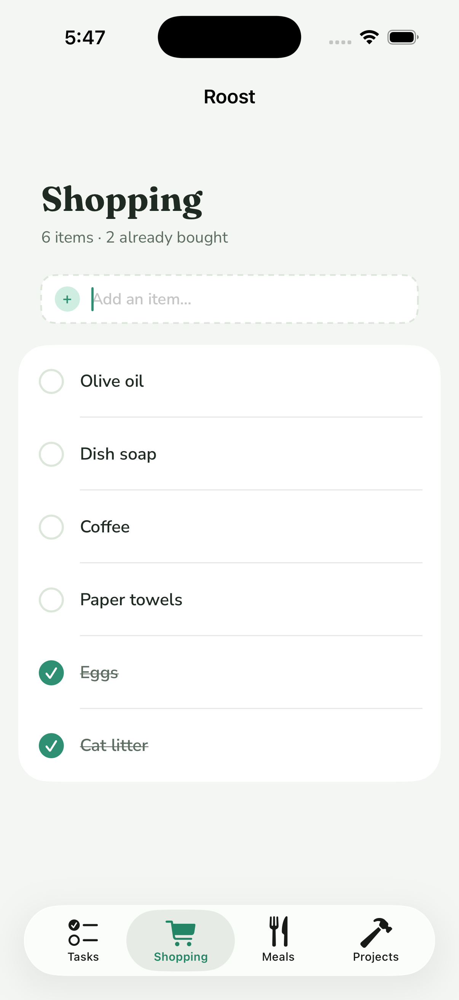
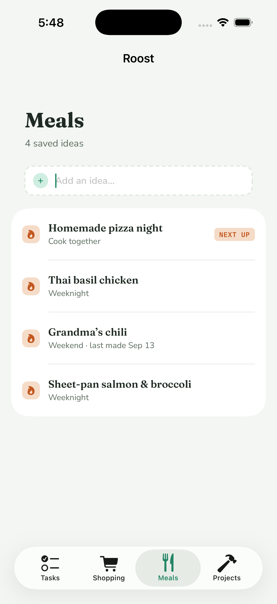
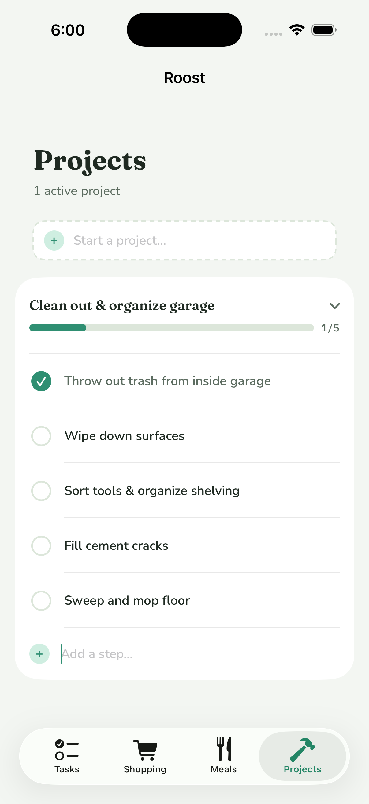

# Roost/ — the iOS app

SwiftUI + SwiftData, iOS 18+, offline-first. The phone keeps its own store and syncs it against `server/` when it can reach it. R-2 built the store and the chore list; R-8 added the Today screen, check-off, pairing, and the sync client; R-10 added the tab shell, the streak header, and the escalation copy; R-11 added the Shopping, Meals, and Projects tabs and their sync; R-17 added Kitchen mode, the counter display.

| Tasks | Shopping | Meals | Projects |
| --- | --- | --- | --- |
|  |  |  |  |

| Kitchen mode |
| --- |
|  |

The four tab screenshots are a fresh, unpaired simulator install: the streaks are tied at 0 so nobody is tagged as ahead, nothing is overdue yet so no row has a subtitle, and the list rows were typed in through the UI. Unpaired, the phone does not know who it is, so the shopping rows carry no initial; the avatar appears once the server stamps `addedBy` from the token. The Kitchen mode screenshot is the same unpaired simulator later that day with three of Anne's chores already checked off (12 + 16 = 28 of 31 still due) and still nothing overdue, so it shows the calm state.

## Layout

```
Roost/
  project.yml                 XcodeGen spec — the source of truth for the project
  Roost.xcodeproj             generated; regenerate, don't hand-edit
  Sources/
    RoostApp.swift            @main: registers fonts, opens (or rebuilds) the store, seeds, owns SyncCoordinator, shows RootTabView
    Strings.swift             every R-10 and R-11 user-facing string: tab titles, list headers and placeholders, streak labels, escalation copy; plus the Kitchen mode strings
    Root/RootTabView.swift    the tab bar (RootTab: Tasks, Shopping, Meals, Projects) and the screen behind each
    Models/Records.swift      SwiftData models: ChoreRecord, CompletionRecord, SyncState (and the schema list)
    Models/ListRecords.swift  SwiftData models for the lists: ShoppingItemRecord, MealRecord, ProjectRecord, SubtaskRecord; the ListRecord sync bookkeeping + PatchFields
    Models/ListActions.swift  every local list write (add, buy, next up, made today, start, step, done, remove), shared by the screens and the tests
    Models/Converters.swift   record <-> RoostCore value types
    Models/ChoreSeeder.swift  idempotent seed from the bundled chores.json (also used for server-sent chores)
    Models/TodayPlanner.swift pure: records -> per-person rows via RoostCore Scheduler/Tallies
    Models/StreakHeaderModel.swift pure: streaks + weekly tallies -> two sides, the leader (nil on a tie), the tally line
    Models/EscalationCopy.swift pure: EscalationStage + category -> row subtitle (nil for dueToday and done rows)
    Models/KitchenModel.swift pure: TodayPlan -> Anne/Wes columns (due count, overdue by stage) + the shared alert list; caught-up rule; "Synced …" line
    Sync/TokenStore.swift     Keychain (app) / in-memory (tests) storage for the device token
    Sync/SyncAPI.swift        typed HTTP client for server/ — no policy, no storage
    Sync/SyncAPI+Lists.swift  the shopping / meals / projects / subtasks endpoints and DTOs
    Sync/SyncClient.swift     @ModelActor: the replay + delta policy, in-flight guard
    Sync/ListSync.swift       the list half of a pass: replay creates/edits/removals, apply the four list deltas
    Sync/ListSync+Records.swift how each list record takes a server row (minus pending edits) and builds its PATCH body
    Sync/SyncCoordinator.swift @Observable main-actor face for the views; owns NotificationScheduler
    Notifications/NotificationCenterClient.swift  the slice of UNUserNotificationCenter we use, behind a protocol
    Notifications/NotificationPlanner.swift       pure: one day's due list -> ids, copy, Chicago fire times
    Notifications/NotificationScheduler.swift     reads the store, clears + reschedules, badge, foreground observer
    Screens/TodayScreen.swift Tasks tab: date, streak header, Anne/Wes sections, check-off, escalation color + copy, gear menu
    Screens/KitchenScreen.swift Kitchen mode: full-screen counter view of both people, screen stays on; Gear -> "Kitchen mode"
    Screens/StreakHeaderView.swift the head-to-head block from the mockup
    Screens/ShoppingScreen.swift Shopping tab: count line, add row, check-off with bought rows sinking, adder avatar, swipe to delete
    Screens/MealsScreen.swift Meals tab: count line, add row (title + tag), NEXT UP badge, "Made it today", swipe to delete
    Screens/ProjectsScreen.swift Projects tab: count line, start row (title + first steps), one card per project with progress, steps, add-step row
    Screens/ListParts.swift   pieces the three list tabs share: header, dashed add row, check circle, avatar, badge, chrome, refocus
    Screens/PairingScreen.swift paste a token, connect, forget
    Screens/ChoreListScreen.swift the R-2 list, reachable from the gear menu as "All chores"
  Tests/                      in-memory ModelContainer + URLProtocol stub; no network
  docs/tasks-r10.png          simulator screenshot, Tasks tab (fresh unpaired install: tied streaks, nothing overdue)
  docs/shopping-r11.png       simulator screenshot, Shopping tab (six rows typed in, two bought)
  docs/meals-r11.png          simulator screenshot, Meals tab (four ideas, one NEXT UP, one made today)
  docs/projects-r11.png       simulator screenshot, Projects tab (one card open with its steps)
  docs/kitchen-r17.png        simulator screenshot, Kitchen mode (unpaired, three chores checked off, nothing overdue: "All caught up.")
  docs/shopping-r10.png       the R-10 placeholder screenshot, kept for history
  docs/today-r8.png           the R-8 screenshot, kept for history
```

Packages are referenced by relative path: `../Packages/RoostCore` (models, scheduler, streaks) and `../Packages/RoostDesign` (colors, fonts). The seed file is `../data/chores.json`, added to the target as a bundle resource in place, so the repo has one copy.

Bundle identifier: `xyz.hinescreative.roost`. Signing is automatic with the team left blank; set the team in Xcode locally, never commit it.

## Build

```bash
brew install xcodegen            # once
cd Roost && xcodegen generate     # after editing project.yml or adding files
open Roost.xcodeproj
```

## Test (headless)

```bash
xcodebuild -project Roost/Roost.xcodeproj -scheme Roost \
  -destination 'platform=iOS Simulator,name=iPhone 17 Pro' test
```

70 tests: seed (31 rows, 2 pinned, idempotent, retire/restore, converters), sync (pairing stores person/cursor/token; 401 stores nothing; a queued completion is POSTed once and marked synced; a 400 marks it rejected and it is never retried; offline keeps the queue; a delete replays as DELETE; a delta with `deleted: true` hides the local row; server-sent chores re-seed; overlapping syncs coalesce), the list replay (a local shopping add is POSTed once and marked synced, with `addedBy` taken from the server's reply; a meal add carries its tag and every other field, so a 201 leaves nothing to PATCH; edits made before a create is replayed outlive the server's stale 200 and go out as a PATCH; a project with first steps goes out as one POST and every step comes back synced; a step added to a synced project POSTs to `/projects/:id/subtasks` and its check-off PATCHes only `done`; a bought toggle PATCHes only `bought`, un-buying PATCHes again, and acknowledged edits are not replayed; "made it today" and "next up" ride one PATCH and the old holder is cleared locally without a request; a delete replays as DELETE and a row the server never saw sends nothing; removing a project cascades locally and sends one DELETE), the list failure modes (a 400 create is kept and never retried; a 503 keeps the queue; a rate-limited DELETE stays queued while the pull still runs; a DELETE the server refuses is acknowledged and never retried; a dead connection ends the pass at the first row with the queue intact), the list delta (a delta with `deleted: true` removes the local row without echoing a DELETE; next-up exclusivity is reflected after a delta; a project delta with subtasks lands in both tables and a cascade delta empties them; the cursor advances to the server's value and holds when nothing changed; a pending local edit outlives a delta carrying the server's older copy of the same row), planning (pinned chores land on the right person; cat care sorts first; a completion today shows as a done row and counts in the tally; overdue days map to the escalation stage), the streak header (the higher streak leads; a tie, including 0 vs 0, has no leader; sides come out Anne then Wes with missing values as 0; the tally line reads `Anne · 14   Wes · 11`; it builds from a plan), the escalation copy (no subtitle for due today; nudge names the chore; pointed depends on category; alert capitalizes the chore; every overdue stage has copy for both categories; rows flow through their stage and done rows get nothing), the root tabs (four tabs in order with their SF Symbols; the list headers read like the mockup, singular and plural), notifications (fixture plan yields the expected ids, Chicago fire times and titles; a replan clears the previous set; the other person's chores never appear; badge count; overlapping replans coalesce), and Kitchen mode (overdue rows group by person and sort by stage descending with the right copy; alert-stage rows from both people land in the banner, most days late first; an empty plan and an all-due-today plan are both caught up; a 5-day-overdue litter box for Wes is a "Scoop litter emergency" in the banner; a missing `activeFrom` falls back to today; the synced line).

## Pairing

First run is unpaired: the Today screen still works locally, the status line says "Not paired · tap the gear". Gear → Pairing:

1. Wes mints a token on the server: `sudo ROOST_TOKENS=/etc/roost/tokens.json node /opt/roost/server/src/mktoken.js anne "Anne iPhone"` (see `server/README.md`).
2. Paste it in the token field. The base URL defaults to `https://roost.hinescreative.xyz`.
3. Connect calls `GET /sync?cursor=0`. On 200 the token goes into the phone's **Keychain** (`kSecClassGenericPassword`, this device only, after first unlock) and `SyncState` stores the base URL and the `person` the server reported. On 401 or a network failure nothing is stored and the error is shown.

The token is never written to UserDefaults, the SwiftData store, or logs. "Forget this device" clears the Keychain item and the pairing fields.

## Sync

`SyncClient` is a `@ModelActor` with its own context. Every pass does, in order:

1. **Replay POSTs.** Each `CompletionRecord` with `syncedAt == nil` is POSTed with its client-generated id, so a retry after a crash or a dead connection is a no-op on the server (201 new, 200 replay). Success stamps `syncedAt` and `seq`. A 400 (unknown or retired chore) sets `rejected`; the row stays visible locally and is never sent again.
2. **Replay DELETEs.** Each row with `removed && !deleteSynced` is DELETEd; 200 or 404 both mark `deleteSynced`. A row that was un-checked before it ever reached the server is marked `deleteSynced` immediately, so nothing is sent.
3. **Replay the lists** (`ListSync.swift`), under the same rules. Creates first: shopping items and meals with their client ids; a project with every step still pending in one `POST /projects` (on a 200 replay the server ignores steps it has not seen, so whatever did not come back in the reply goes through `POST /projects/:id/subtasks` next, as does any step added to a project the server already has). Then edits: each row with `pendingPatch != 0` is PATCHed with only the fields flagged there (`PatchFields`: title, bought, tag, lastMadeAt, nextUp, done, sortOrder), so a stale copy of a field the other phone edited is never sent; success clears the flags and applies the server's row. Then removals: steps, then projects (the server cascades a project's steps, so `ListActions.removeProject` acknowledges them locally and only the project is sent; the reply carries the steps' new seqs), then shopping items and meals. 2xx marks a row synced: a 201 create clears the flags for the fields the body carried, while a 200 replay ignored the body, so every flag stays and the edit goes out as a PATCH in the same pass. 400 (or a 404 on a PATCH) marks a row `rejected` and it is never retried; a DELETE the server refuses is acknowledged the same way, and a 404 there counts as done. 401 and a transport failure end the pass with everything so far saved and the queue intact. Anything else (429, 5xx, an unreadable reply) is one row's problem for one pass: it stays queued, the next row goes ahead, and so does the pull, so a stuck row never blocks what the other phone did.
4. **Pull the delta.** `GET /sync?cursor=<SyncState.cursor>&choresVersion=<SyncState.choresVersion>`. Completions, shopping, meals, projects, and subtasks are upserted by id, honoring `deleted`; a local row with a pending delete keeps its local intent until the DELETE has run, and a row with a pending edit keeps its flagged fields and takes the rest from the server. A meal arriving with `nextUp` clears it on every other local meal that has no pending edit, mirroring the server. If the server included `chores` (version mismatch), they are re-seeded through `ChoreSeeder` exactly like the bundle. The new `cursor` (the max seq across all five arrays, as the server reports it) and `choresVersion` are stored.

It runs on launch, when the app returns to the foreground, after every check-off and every list write, and from Gear → Sync now. An in-flight guard coalesces overlapping calls into at most one extra pass.

**Offline is not an error.** A transport failure or 5xx leaves the queue untouched, returns `.failed`, and the next trigger retries. Only a 401 aborts the pass (the token was revoked; re-pair).

## Screens

The root is `RootTabView`, a `TabView` over the `RootTab` enum: Tasks (`checklist`), Shopping (`cart`), Meals (`fork.knife`), Projects (`hammer`), tinted `RoostColor.accent`. The gear menu (Kitchen mode, All chores, Pairing…, Sync now) stays on Tasks.

Every user-facing string, the tab titles, the list headers and placeholders, the streak labels, and the escalation copy, lives in `Sources/Strings.swift`, so the wording can change without touching a screen. R-17's Kitchen mode strings sit in the same file under `Strings.Kitchen`.

The three list tabs share one shape (`ListParts.swift`): the tab title in the display face over a count line, a dashed "Add…" row with a plus badge, then inset cards on the page color. Every row reads from SwiftData through `@Query`; every write goes through `ListActions` (store first, then `SyncCoordinator.syncSoon()`), so the tap is on screen before the network is involved and works the same offline. Return on an add row keeps the field focused (`refocus`), so several lines can be typed in a row; Return on a blank row clears it and lets the keyboard go. `ListActions` trims text and cuts it to the server's limits (200 characters for a title, 40 for a tag, 100 first steps on a create) rather than letting the create be refused. Swipe left on any row to delete it. To VoiceOver a row with a check circle is its title, with the state ("Bought", "Not done") as the value and what a tap does as the hint.

### Tasks

`TodayPlanner.plan` feeds `RoostCore.Scheduler` the active chores and non-removed completions, with `activeFrom` = the household start (fixed on first render as the earlier of today and the earliest completion, then persisted in `SyncState`). For each person it lists what is due, cat care first, most overdue first, followed by rows completed today so they can be un-checked. The header shows the Chicago date, the streak block, the week's tallies, and the sync status line.

**Streak header.** `StreakHeaderModel` takes the plan's per-person streaks (`RoostCore.Tallies.streak`, so `activeFrom` comes from `SyncState`) and weekly tallies. Each side shows the name, the streak number, and "day streak". The side with the strictly higher streak gets a "CURRENTLY AHEAD" tag and its number in `RoostColor.gold`; a tie tags nobody. Under the block a mono line carries the week's completions: `Anne · 14   Wes · 11`.

**Escalation.** Row color follows `EscalationStage`: due today = ink, 1–2 days = gold, 3–4 = tease, 5+ = alert, with a `ND LATE` badge when overdue. `EscalationCopy.subtitle` adds a line under the title once a row is overdue: nudge → "Still no <title>…" (title lowercased to read mid-sentence, unless it starts with an acronym like "PM wet cat food"), pointed → "The cat has feelings about this." for cat-care rows and "Getting overdue." for home rows, alert → "<Title> emergency". Due-today rows and done rows show no subtitle.

Checking a row inserts a `CompletionRecord` (UUID id, `completedAt` now, UTC) and kicks a sync. Tapping a done row soft-deletes it.

### Kitchen mode

Gear → Kitchen mode presents `KitchenScreen` full-screen (`fullScreenCover`, no navigation chrome) for a phone propped on the counter. It shows both people at once and is read-only; check-off stays on the Tasks tab. Tap anywhere, or the Close pill, to leave.

`KitchenModel` is built from the same `TodayPlanner.plan` as the Tasks tab, so the two can never disagree. Top to bottom:

- **Date line** in the mono eyebrow style, with Close on the right.
- **Alert banner**, only when something is at the alert stage (5+ days): a full-width `alertSoft` panel with an `alert` border headed "VISIBLE TO BOTH OF YOU", listing every alert-stage chore from *either* person, most days late first, each as its `EscalationCopy` line ("Scoop litter emergency") over the person's name and "N DAYS LATE".
- **Two columns, Anne | Wes.** Each has the name, a big number of everything the person owes today (overdue included, the same count as the Tasks tab's "N DUE"), and "DUE TODAY". Under it, the person's overdue chores as cards sorted by stage descending (alert, pointed, nudge; within a stage the Tasks tab's order, cat care first then most days late), in the stage's color with the stage label, the title, and the escalation copy. A person with nothing overdue while the other has something reads "Nothing overdue."
- **"All caught up."** replaces the cards when neither person has anything overdue; due-today rows do not count.
- **"Synced 5 minutes ago"** at the bottom, from `SyncCoordinator.lastSyncAt` ("Synced just now" inside a minute, "Not synced yet" before the first sync).

It follows the system appearance through the `RoostColor` tokens (ink on `bg` in light, the dark set in dark). While it is up `UIApplication.shared.isIdleTimerDisabled` is true, and the previous value is put back on dismiss. It re-renders on every store change (the `@Query` rows), on the coordinator's published sync state, and every 60 seconds through a `TimelineView`, so days-late counts and the synced line move on their own.

### Shopping

Header: "N items · M already bought" (total live rows, and how many are ticked). "Add an item…" inserts a `ShoppingItemRecord` with a UUID id, `addedBy` = the paired person (blank when unpaired; the server stamps it from the token and the reply overwrites it). Rows show the check circle, the title, and the adder's initial in a small `RoostColor.assign` avatar. Tapping a row flips `bought` (with a local `boughtBy`/`boughtAt` preview the server's stamp replaces) and flags it for PATCH; bought rows sink to the bottom, struck through, most recently bought first, while unbought rows stay newest first.

### Meals

Header: "N saved ideas". "Add an idea…" takes a title and, once there is one, a tag ("Weeknight"); Return on either field saves. Rows show a flame badge in the mockup's meal colors, the title in the display face, and a meta line of tag and "last made <Mon d>" when set. The meal with `nextUp` carries a `NEXT UP` badge and sorts first. Swipe right, or long-press, for "Next up" / "Clear next up"; the context menu also has "Made it today" (sets `lastMadeAt` to now) and Delete. Setting next-up clears it on every other local meal at once; those rows are not flagged, because the server clears them itself and the next delta confirms it.

### Projects

Header: "N active projects". "Start a project…" takes a title and, once there is one, a "First steps, one per line" field and a Start button (Return on the title also starts). Each project is its own card: the title, a chevron, and a progress bar with "done/total" over its live steps. Tapping the card opens it (the first card opens on its own, like the mockup): the steps with check-off (strikethrough when done, `doneBy`/`doneAt` previewed locally) and an "Add a step…" row that appends after the highest `sortOrder`, the server's default. Swipe a project or a step to delete; deleting a project removes its steps locally too.

## Store rules

- `ChoreRecord.retired` hides chores removed from the list without losing completion history.
- `CompletionRecord.id` is client-generated; the server dedupes on it. `syncedAt` stays nil until acknowledged. `removed` is the soft-delete flag (named to avoid CoreData's reserved `isDeleted`); `deleteSynced` and `rejected` are sync bookkeeping.
- `ShoppingItemRecord`, `MealRecord`, `ProjectRecord`, and `SubtaskRecord` (`ListRecords.swift`) mirror their server rows field for field and share the completion bookkeeping through the `ListRecord` protocol (`syncedAt`, `removed`, `deleteSynced`, `rejected`, `seq`) plus `pendingPatch`, a `PatchFields` bitmask of the fields edited locally since the server last saw the row. `needsPost` / `needsPatch` / `needsDelete` read the state machine; `markEdited` and `markRemoved` write it. Subtasks point at their project by `projectId`, not a relationship.
- `SyncState` is a single row: `cursor` (server seq), `choresVersion`, `baseURL`, `person`, `activeFrom`, `lastSyncAt`.
- Pre-release: if the on-disk store cannot be migrated, `RoostApp` deletes it and rebuilds. Chores re-seed from the bundle and completions come back from the server on the next sync. This goes away once the schema is stable.

## Notifications

Local only (`UserNotifications`, no server involvement). `NotificationScheduler.replan()` rewrites the pending set after every successful sync and whenever the app becomes active (launch and foreground); overlapping replans coalesce. Each pass clears every pending Roost notification, then schedules, for the paired person only:

- **09:00 Chicago** one digest listing what is due that day (skipped when nothing is due).
- **18:00 Chicago** one notification per overdue chore, worded by `EscalationStage` as in the mockup: nudge "Still no <title>…", pointed "The cat has feelings about this." (cat care) or "Getting overdue." (home), alert "<Title> emergency".

Identifiers are deterministic per chore and date (`roost.overdue.<choreId>.<yyyy-MM-dd>`, `roost.digest.<yyyy-MM-dd>`), so a replan replaces rather than duplicates. The plan covers today and tomorrow (tomorrow assumes nothing else gets done and is replaced by the next replan) so a phone opened after 18:00 still gets the next ping. The app badge is the paired person's overdue count, updated with each replan. An unpaired phone gets nothing and a zero badge.

Permission (alert, sound, badge) is requested the first time pairing succeeds, not on first launch.

The other person's chores never produce a local notification here, so the mockup's "red alert visible to both of you" needs a push from the server: that is ticket R-6b (APNs), waiting on a key. Kitchen mode's banner shows both people's alerts on whichever phone is on the counter, but it is a display, not a ping.
