# Roost/ — the iOS app

SwiftUI + SwiftData, iOS 26+, offline-first. The phone keeps its own store and syncs it against `server/` when it can reach it. R-2 built the store and the chore list; R-8 added the Today screen, check-off, pairing, and the sync client; R-10 added the tab shell, the streak header, and the escalation copy; R-11 added the Shopping, Meals, and Projects tabs and their sync; R-17 added Kitchen mode, the counter display; D-2 was a craft pass over the Tasks tab (design tokens throughout, the check-off interaction, visible escalation, the empty and offline states, and one celebration a day); D-3 made the three list tabs finished screens (a composer, a Bought section, a five-second undo on every delete, drag-to-reorder steps, finished projects); D-4 added first-run onboarding, pairing by six-digit code, and the Settings screen; D-4b restyled Settings in the design system and gave it the server's own device label and pairing date from `GET /me`; D-5 registered this phone for the server's APNs pushes and added the Home Screen and Lock Screen widget; D-8 added handoffs — offering a turn to the other person — and moved the household start date onto the server. D-6 added the UI test target: an accessibility audit per screen that runs in CI, the fixes it found, and the Shopping list's scroll metrics.

| Tasks | Shopping | Meals | Projects |
| --- | --- | --- | --- |
| 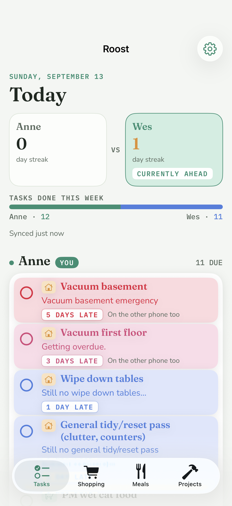 | 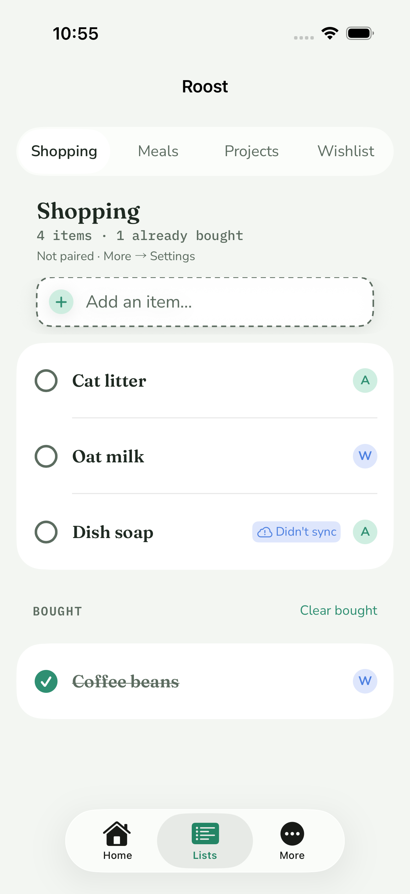 | 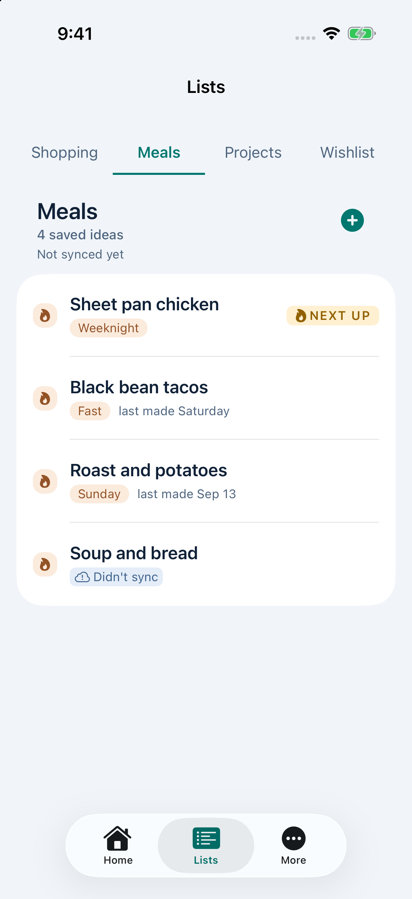 | 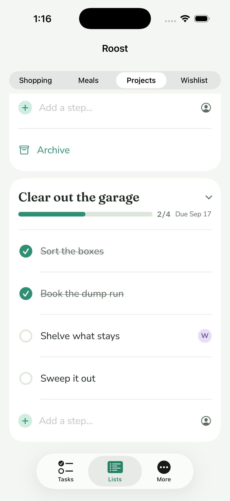 |
| 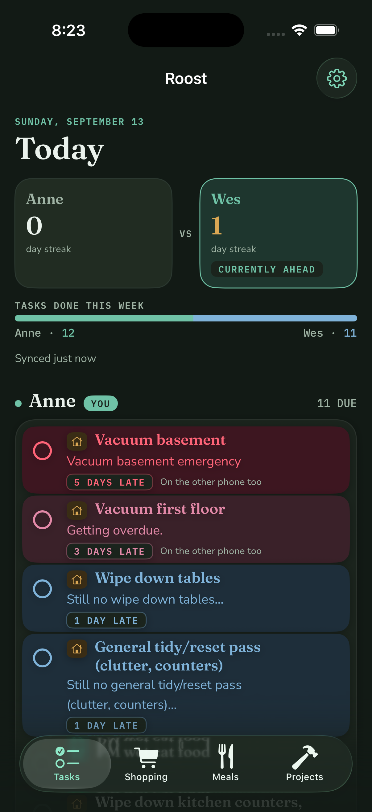 | 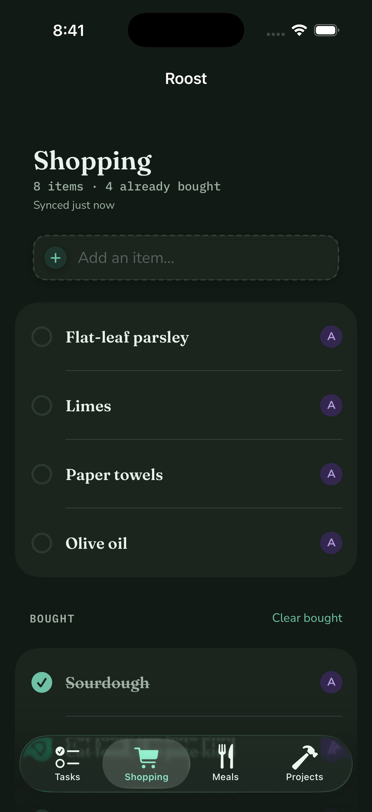 | 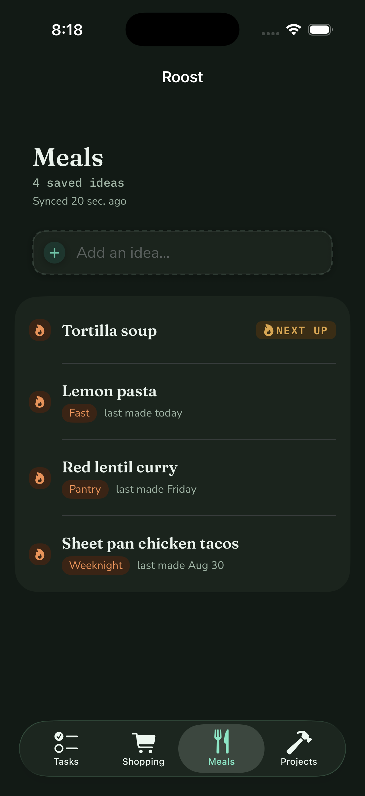 | 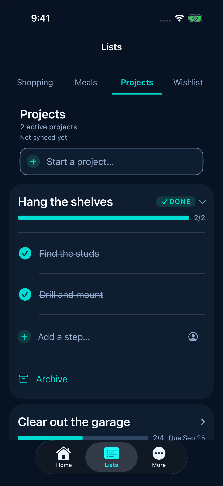 |

| Kitchen mode | Tasks, largest accessibility size |
| --- | --- |
| 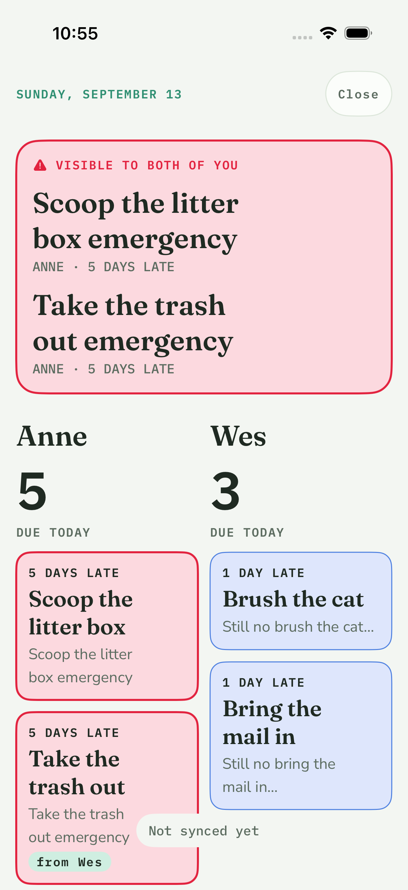 | 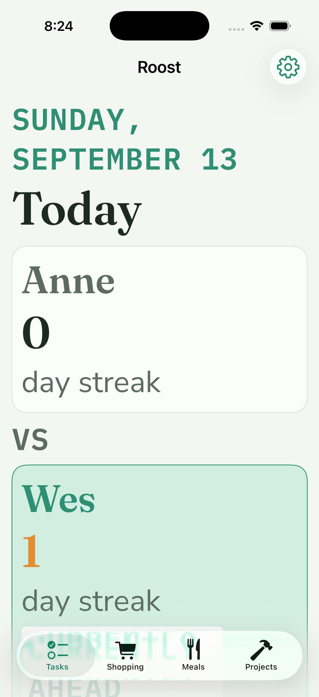 |

| First run | The code | A code that didn't work | Settings |
| --- | --- | --- | --- |
| 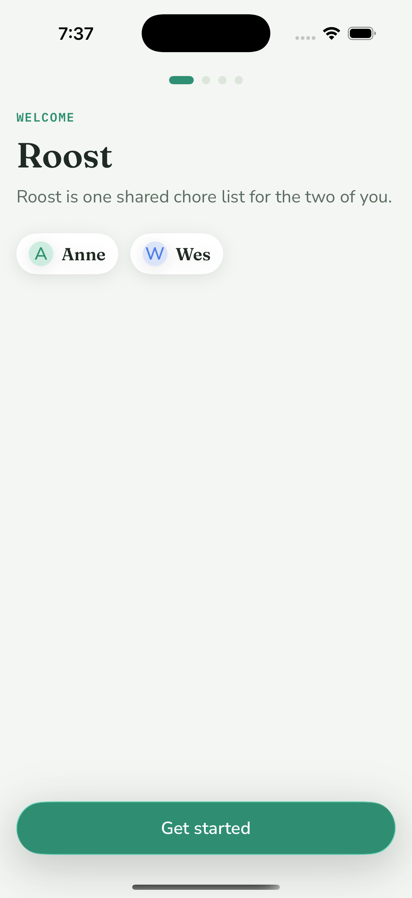 | 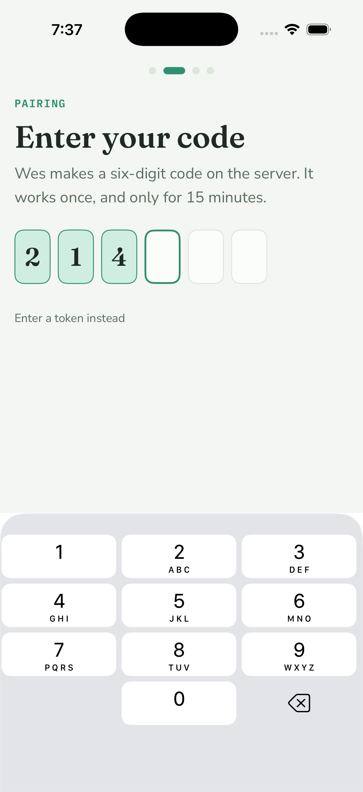 | 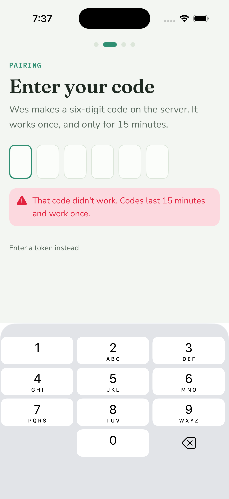 | 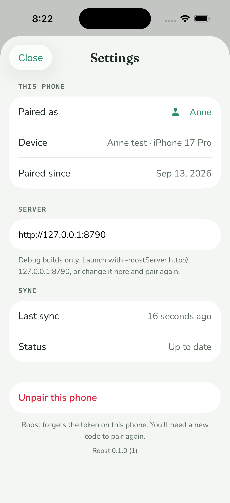 |

| Settings, dark |
| --- |
| 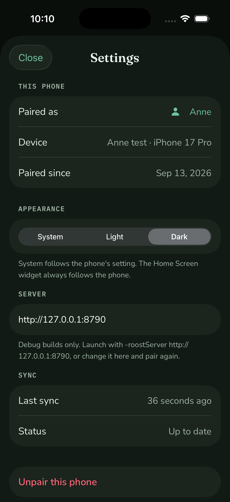 |

| Widget, small | Widget, medium |
| --- | --- |
| 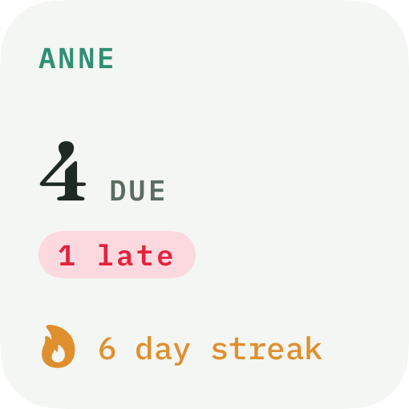 | 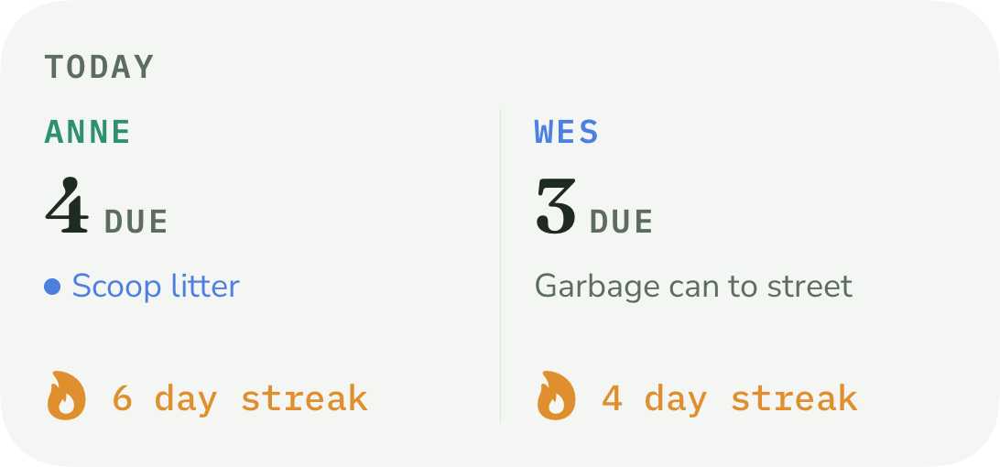 |

| A turn offered | The other phone | The other phone, dark |
| --- | --- | --- |
| 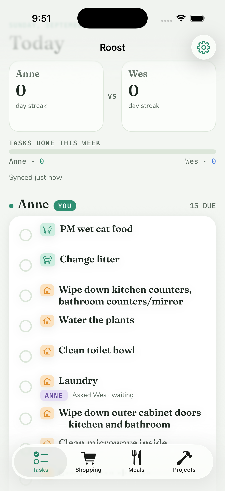 | 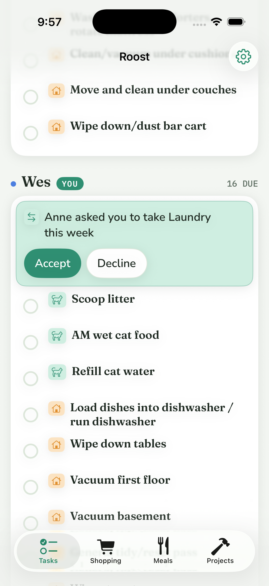 | 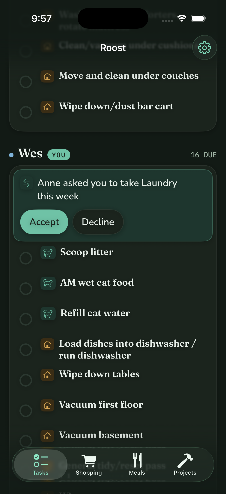 |

One file per screen state, replaced in place rather than kept per ticket.

The Tasks screenshots are one phone paired as Anne against a local server seeded with the week's history (the household started that Monday), so
the whole escalation ladder is on screen at once: 5 days late in the danger role, 3 days late in the warning
role, two rows 1 day late in the notice role, then the rows that are simply due today — loudest first, so the
colour only gets calmer going down the card. Wes's own column, its rows, and the celebration are below the fold.
`tasks-ax.png` is the same screen at the largest accessibility text size, where the two streak cards stack
instead of sitting side by side; further down, the person header stacks name / YOU / count and the week tally
goes one line per person.

Kitchen mode is the `paired` UI-test fixture (`-roostUITestState paired`), so it is the one screenshot here
anybody can reproduce with a single command: both alert-stage chores in the shared banner, then each person's
column with the stage as the card's fill and border and the words in ink. D-6 replaced the old one, which
predated the restyle and showed the calm "All caught up." state instead.

The three list screens are paired as Anne against a local server, each in light and dark. Shopping has four rows still to buy over a Bought section with "Clear bought", and the header line reads "Synced just now" because the pass had only landed a moment before. Meals has one idea marked NEXT UP and three with a tag and a "last made" line, one of them a weekday and one a date. Projects has a finished card open (DONE chip, full bar, Archive) over a second card at 2/4.

The handoff shots are the two ends of one real offer against a local server whose `activeFrom` is today, so nothing is overdue and the handoff is the only thing on screen. `handoff-offer.png` is Anne's phone a moment after she offered Laundry: the row keeps its ANNE pin and reads "Asked Wes · waiting". `handoff-incoming.png` is Wes's phone — a second, freshly paired install — where the offer is the card at the top of his own column, and `handoff-incoming-dark.png` is the same card in dark mode.

## Layout

```
Roost/
  project.yml                 XcodeGen spec — the source of truth for the project
  Roost.xcodeproj             generated; regenerate, don't hand-edit
  Config/Local.xcconfig       committed, no values; `#include?`s the override below
  Config/Local.override.xcconfig  gitignored: DEVELOPMENT_TEAM, and nothing else
  Sources/
    RoostApp.swift            @main: registers fonts, opens (or rebuilds) the store, seeds, owns SyncCoordinator, shows RootGate
    Strings.swift             every user-facing string: tab titles, list headers, placeholders and empty states, the undo and "Didn't sync" wording, streak labels, escalation copy, Kitchen mode, onboarding and Settings
    Root/RootTabView.swift    the tab bar (RootTab: Tasks, Shopping, Meals, Projects) and the screen behind each
    Onboarding/RootGate.swift the first thing shown: the flow while there is no token, the tabs once there is
    Onboarding/OnboardingFlow.swift the four steps and the transition between them
    Onboarding/OnboardingPage.swift the shape every step shares: eyebrow, title, line, content, bottom action; the dots
    Onboarding/WelcomeStep.swift  what this is, in one sentence
    Onboarding/CodeStep.swift     the six digits, what went wrong, and the token link
    Onboarding/CodeEntryField.swift six boxes drawn over one invisible text field; one VoiceOver element
    Onboarding/ConfirmStep.swift  "You're Anne", in Anne's colour
    Onboarding/NotificationsStep.swift the rationale, then the system prompt; "Not now" allowed
    Onboarding/TokenSheet.swift   the hand-minted fallback, behind a small link on the code screen
    Onboarding/PairingModel.swift pure: the pairing state machine (typing, pasting, the four failures) + DeviceName
    Onboarding/ServerEndpoint.swift which server this phone talks to (production, stored, or the DEBUG override)
    Models/Records.swift      SwiftData models: ChoreRecord, CompletionRecord, SyncState (and the schema list)
    Models/HandoffRecords.swift SwiftData model for a handoff: the server row, the ListRecord bookkeeping, and the two local-only fields
    Models/ListRecords.swift  SwiftData models for the lists: ShoppingItemRecord, MealRecord, ProjectRecord, SubtaskRecord; the ListRecord sync bookkeeping + PatchFields
    Models/ListActions.swift  every local list write (add, buy, next up, made today, start, step, done, reorder, remove, restore), shared by the screens and the tests
    Models/ListPresentation.swift pure: the list screens' arithmetic — the bought/to-buy split, project progress, the sortOrder plan for a drag, the "last made" wording
    Models/Converters.swift   record <-> RoostCore value types
    Models/HandoffActions.swift every local handoff write (offer, answer, withdraw, clear the notice), shared by the screen and the tests
    Models/HandoffPresentation.swift pure: handoffs -> what a row says, which offers are waiting, and the period phrase
    Models/ChoreSeeder.swift  idempotent seed from the bundled chores.json (also used for server-sent chores)
    Models/TodayPlanner.swift pure: records -> per-person rows via RoostCore Scheduler/Tallies
    Models/StreakHeaderModel.swift pure: streaks + weekly tallies -> two sides, the leader (nil on a tie), the tally line
    Models/EscalationCopy.swift pure: EscalationStage + category -> row subtitle (nil for dueToday and done rows)
    Models/SyncStatusCopy.swift pure: how long ago the last pass reads in the header — just now, seconds, minutes, then the clock time
    Models/KitchenModel.swift pure: TodayPlan -> Anne/Wes columns (due count, overdue by stage) + the shared alert list; caught-up rule; "Synced …" line
    Sync/TokenStore.swift     Keychain (app) / in-memory (tests) storage for the device token
    Sync/SyncAPI.swift        typed HTTP client for server/ — no policy, no storage
    Sync/SyncAPI+Lists.swift  the shopping / meals / projects / subtasks endpoints and DTOs
    Sync/SyncAPI+Handoffs.swift the /handoffs endpoints, the handoff DTO, and the 409 conflict that carries the server's row
    Sync/SyncClient.swift     @ModelActor: the replay + delta policy, in-flight guard
    Sync/ListSync.swift       the list half of a pass: replay creates/edits/removals, apply the four list deltas
    Sync/ListSync+Records.swift how each list record takes a server row (minus pending edits) and builds its PATCH body
    Sync/HandoffSync.swift    the handoff half of a pass: replay offers then answers, apply the handoff delta
    Sync/SyncCoordinator.swift @Observable main-actor face for the views; owns NotificationScheduler, PushService, SnapshotWriter
    Sync/SyncAPI+Push.swift   POST / DELETE /push/token
    Sync/SyncClient+Push.swift the same two calls with the paired base URL and bearer; PushSendResult
    Notifications/NotificationCenterClient.swift  the slice of UNUserNotificationCenter we use, behind a protocol
    Notifications/NotificationPlanner.swift       pure: one day's due list -> ids, copy, Chicago fire times
    Notifications/NotificationScheduler.swift     reads the store, clears + reschedules, badge, foreground observer
    Push/PushToken.swift          pure: the APNs token as the server wants it (64 lowercase hex)
    Push/PushRegistration.swift   pure: the idempotency rule, and the one thing it remembers (UserDefaults)
    Push/RemoteNotifications.swift the slice of UIKit/UserNotifications registration needs, behind a protocol
    Push/PushService.swift        registers, unregisters before an unpair, and routes an arriving push
    Push/RoostAppDelegate.swift   the only UIKit: the two APNs callbacks and the notification-center delegate
    Snapshot/SnapshotBuilder.swift pure: TodayPlan -> RoostSnapshot, with the top three in the Tasks tab's order
    Snapshot/SnapshotWriter.swift reads the store, plans, writes the App Group file, reloads the timelines
    Screens/TodayScreen.swift Tasks tab: the store queries, the plan, check-off and un-check, the celebration counter, the gear menu
    Tasks/TodayBoard.swift    pure: the card's order, the celebration rule, the week's split, the status line and its wording
    Tasks/TaskStyle.swift     which RoostColor role each EscalationStage wears, and which RoostPerson each Person is
    Tasks/TodayHeaderView.swift the date eyebrow, "Today", the streak block, and the one-line sync notice
    Tasks/PersonColumnView.swift one person's header ("Anne  YOU  9 DUE") and their card of rows
    Tasks/ChoreRowView.swift  the row: the 44 pt check control, the title, the escalation copy, the days-late chip, the handoff chip and menu
    Tasks/HandoffOfferCard.swift the card at the top of your column when the other person has asked you to take something
    Tasks/CelebrationView.swift the one burst a day, or a checkmark that scales in under Reduce Motion
    Screens/KitchenScreen.swift Kitchen mode: full-screen counter view of both people, screen stays on; Gear -> "Kitchen mode"
    Screens/StreakHeaderView.swift the head-to-head block from the mockup
    Screens/ShoppingScreen.swift Shopping tab: composer, to-buy rows, Bought section + "Clear bought", check-off, swipe to delete with undo
    Screens/MealsScreen.swift Meals tab: composer (title + tag), NEXT UP badge, "Made it" + "last made …", tag chips, swipe to delete with undo
    Screens/ProjectsScreen.swift Projects tab: composer, one card per project with an animated bar and a counting number, steps reorderable by drag, DONE chip + Archive
    Screens/ListParts.swift   pieces the three list tabs share: header + sync line, the composer, check circle, avatar, chips, the "Didn't sync" marker, empty states, swipe-to-delete, the undo bar and its five-second window, and `RoostTextActionStyle` — a text-only action that holds 44 pt, used from the onboarding screens too
    Screens/SettingsScreen.swift Gear -> Settings: paired as, device, paired since, server, last sync, Unpair, version
    Screens/SettingsModel.swift  the GET /me call behind those rows, and the fallback when it fails
    Screens/ChoreListScreen.swift the R-2 list, reachable from the gear menu as "All chores"
    Debug/UITestSeed.swift    DEBUG only: the store `-roostUITestState <name>` launches into. No server, fixed rows
  Roost.entitlements          generated by xcodegen from project.yml: aps-environment, the App Group
  Shared/                     compiled into the app and the widget, and nothing else crosses between them
    RoostSnapshot.swift       the Codable snapshot: per person the counts, the streak, the top three; generatedAt
    SnapshotStore.swift       the one file in the App Group container, and the two ways of getting one
  Widget/                     the WidgetKit extension (bundle id xyz.hinescreative.roost.widget)
    RoostWidgetBundle.swift   @main: registers the fonts in this process, then the one widget
    TodayWidget.swift         the timeline provider (read the file, one entry, refresh after 30 minutes)
    TodayWidgetView.swift     the four families, the two empty states, and the previews
    TodayWidgetView.swift, WidgetStyle.swift, WidgetStrings.swift and TodayWidget.swift are also compiled
      into the app target, so `WidgetRenderTests` can render them — nothing in the app draws them
    WidgetStyle.swift         stage -> colour role, person -> RoostPerson; mirrors Tasks/TaskStyle.swift
    WidgetStrings.swift       every user-facing string in the widget, the same rule Strings.swift follows
    RoostWidget.entitlements  generated by xcodegen: the App Group
    Info.plist                generated by xcodegen: NSExtensionPointIdentifier
  Tests/                      in-memory ModelContainer + URLProtocol stub; no network
  UITests/                    XCUITest: one accessibility audit per screen, and the Shopping list's scroll metrics
    RoostUITestCase.swift     the launch, the taps that reach each screen, and the one audit call they share
    AccessibilityAuditTests.swift one test per screen, and what each screen is knowingly not fixed for
    ScrollPerformanceTests.swift  200 rows: the deceleration metric, the laziness gate, a wall-clock ceiling
  docs/onboarding.png         simulator screenshot, first run (no token in the Keychain)
  docs/pairing.png            simulator screenshot, the code half typed in
  docs/pairing-error.png      simulator screenshot, a code the server answered 404 to
  docs/settings.png           simulator screenshot, Settings while paired against a local server (the device line and date are the server's)
  docs/settings-dark.png      simulator screenshot, the same screen in dark mode
  docs/tasks.png              simulator screenshot, Tasks tab (paired as Anne, the whole escalation ladder on screen)
  docs/tasks-dark.png         the same screen in dark mode
  docs/tasks-ax.png           the same screen at the largest accessibility text size
  docs/shopping.png           simulator screenshot, Shopping tab; docs/shopping-dark.png is the same screen in dark mode
  docs/meals.png              simulator screenshot, Meals tab; docs/meals-dark.png in dark mode
  docs/projects.png           simulator screenshot, Projects tab; docs/projects-dark.png in dark mode
  docs/kitchen.png            simulator screenshot, Kitchen mode, from the `paired` UI-test fixture
  docs/widget-small.png       the small family, rendered in the simulator by WidgetRenderTests
  docs/widget-medium.png      the medium family, the same way
```

Packages are referenced by relative path: `../Packages/RoostCore` (models, scheduler, streaks) and `../Packages/RoostDesign` (colors, fonts). The seed file is `../data/chores.json`, added to the target as a bundle resource in place, so the repo has one copy.

Bundle identifier: `xyz.hinescreative.roost`; the widget extension is `xyz.hinescreative.roost.widget`. Signing is automatic with the team left blank; set the team in Xcode locally, never commit it. A real device needs Wes's team for signing — the simulator does not.

## Build

```bash
brew install xcodegen            # once
cd Roost && xcodegen generate     # after editing project.yml or adding files
open Roost.xcodeproj
```

### Signing, and the Team ID

A fresh checkout has no team and needs none: the simulator applies entitlements from the
binary, and `CODE_SIGNING_ALLOWED=NO` produces no entitlements at all. That is how CI
builds and tests the whole thing without an Apple account.

A real device, and `scripts/release.sh`, need a Team ID. It lives in
`Config/Local.override.xcconfig`, which is gitignored:

```bash
cp Roost/Config/Local.override.xcconfig.example Roost/Config/Local.override.xcconfig
$EDITOR Roost/Config/Local.override.xcconfig       # DEVELOPMENT_TEAM = ABCDE12345
```

`Config/Local.xcconfig` is the committed half. It holds no values and does one thing —
`#include? "Local.override.xcconfig"` — and `project.yml` points both the app and the
widget at it as their `configFiles` for Debug and Release. The `?` makes the include
optional, so the file has to exist (xcodegen validates `configFiles` paths and fails the
generate if one is missing) while the Team ID does not. A target xcconfig outranks the
project-level `DEVELOPMENT_TEAM: ""`, so the override wins wherever it exists, and the
generated `project.pbxproj` is byte-identical either way.

It is in `Config/` rather than next to `project.yml` because xcodegen 2.46.0 gives a config
file in the spec's own directory a fresh random `TEMP_<uuid>` object id on every run when
`createIntermediateGroups` is on, which would break the CI step asserting that a
regenerate is a no-op.

Releases, the portal setup behind them, and pairing a new phone: `docs/RELEASE.md`.

## Test (headless)

```bash
xcodebuild -project Roost/Roost.xcodeproj -scheme Roost \
  -destination 'platform=iOS Simulator,name=iPhone 17 Pro' test
```

273 unit tests and 12 UI tests. The unit tests: seed (31 rows, 2 pinned, idempotent, retire/restore, converters), sync (pairing stores person/cursor/token; 401 stores nothing; a queued completion is POSTed once and marked synced; a 400 marks it rejected and it is never retried; offline keeps the queue; a delete replays as DELETE; a delta with `deleted: true` hides the local row; server-sent chores re-seed; overlapping syncs coalesce), the list replay (a local shopping add is POSTed once and marked synced, with `addedBy` taken from the server's reply; a meal add carries its tag and every other field, so a 201 leaves nothing to PATCH; edits made before a create is replayed outlive the server's stale 200 and go out as a PATCH; a project with first steps goes out as one POST and every step comes back synced; a step added to a synced project POSTs to `/projects/:id/subtasks` and its check-off PATCHes only `done`; a bought toggle PATCHes only `bought`, un-buying PATCHes again, and acknowledged edits are not replayed; "made it today" and "next up" ride one PATCH and the old holder is cleared locally without a request; a delete replays as DELETE and a row the server never saw sends nothing; removing a project cascades locally and sends one DELETE), the list failure modes (a 400 create is kept and never retried; a 503 keeps the queue; a rate-limited DELETE stays queued while the pull still runs; a DELETE the server refuses is acknowledged and never retried; a dead connection ends the pass at the first row with the queue intact), the list delta (a delta with `deleted: true` removes the local row without echoing a DELETE; next-up exclusivity is reflected after a delta; a project delta with subtasks lands in both tables and a cascade delta empties them; the cursor advances to the server's value and holds when nothing changed; a pending local edit outlives a delta carrying the server's older copy of the same row), planning (pinned chores land on the right person; cat care sorts first; a completion today shows as a done row and counts in the tally; overdue days map to the escalation stage), the streak header (the higher streak leads; a tie, including 0 vs 0, has no leader; sides come out Anne then Wes with missing values as 0; the tally line reads `Anne · 14   Wes · 11`; it builds from a plan), the escalation copy (no subtitle for due today; nudge names the chore; pointed depends on category; alert capitalizes the chore; every overdue stage has copy for both categories; rows flow through their stage and done rows get nothing), the root tabs (four tabs in order with their SF Symbols; the list headers read like the mockup, singular and plural), notifications (fixture plan yields the expected ids, Chicago fire times and titles; a replan clears the previous set; the other person's chores never appear; badge count; overlapping replans coalesce), pairing (the sixth digit submits and five do not; a 404 clears the boxes, counts a rejection and offers no retry; a 429 and a dead connection keep the code and offer one; a retry after a transport failure pairs; a pasted code with spaces or words around it fills every box and submits once; a short paste waits; deleting a digit clears the message without resubmitting; digits arriving mid-attempt are ignored; every status code maps to one sentence; the device name is trimmed to the server's 60; the stored base URL beats production and junk does not; POST /pair carries the code and the device name and no bearer, and its 404/429/400/403/500 and a dead connection come back typed; DELETE /pair/self carries the bearer and reads the label, and its 403 is `forbidden`; pairing by code stores the token the server minted and a failure stores nothing; unpairing tells the server then forgets the token, a hand-minted device is forgotten locally with a note, an unreachable server still unpairs this phone, and a phone that was never paired sends nothing), the Settings rows (the server's label replaces this phone's own name and a failed call leaves it in place; a success after a failure clears the failure; an unpaired phone is not a failure; paired-since is the server's date, "Set up by hand" for a tokens-file device, and absent when the server gave no date; the person comes from the server; two refreshes at once are one request; `GET /me` carries the bearer to `/me` and becomes a `DeviceIdentity`, a `file` token has no pairing date, a label the server left blank reads as none, and a revoked token is `unauthorized`), the Tasks board (the card runs loudest first and inside one stage keeps the planner's order, done rows sink to the bottom, and nothing is lost or duplicated; the week bar's split, including the empty track before anybody has done anything; every escalation stage maps to its own colour role and soft fill, and only from three days is a row “on the other phone too”; clearing your own column fires the celebration once a day and never for the other person's column, an un-check, or an unpaired phone; and the status line prints `SyncCoordinator.statusLine` verbatim in every ordinary state — so the Tasks header and the list tabs can never disagree — overriding it only when the phone is unpaired or the last pass failed, and the offline line words “when” with `SyncStatusCopy`, the same helper the coordinator's own line uses), and Kitchen mode (overdue rows group by person and sort by stage descending with the right copy; alert-stage rows from both people land in the banner, most days late first; an empty plan and an all-due-today plan are both caught up; a 5-day-overdue litter box for Wes is a "Scoop litter emergency" in the banner; a missing `activeFrom` falls back to today; the synced line), the list craft (`ListCraftTests`: the bought/to-buy split keeps its two orders and tolerates a missing `boughtAt`; undo of a delete that never left the phone un-removes the same row and sends nothing, undo of one that did inserts a copy under a new id with `bought` flagged for the PATCH that follows the create, and a synced row's pending edit survives either way; "Clear bought" empties the section and restores all of it; a meal's copy carries every field; undoing a project restores exactly the steps that cascaded with it, and rebuilds them with new ids once the server has cascaded too; `SubtaskOrder` sends one midpoint row when there is a gap, `previous + 16` at the end, `first / 2` at the front, renumbers on a stride only when there is no room, stays strictly increasing inside the server's range, and sends nothing for a no-op move; a project is finished only when it has steps and all of them are done, and ticking or deleting the last one flips it; the progress fraction; `MealDates` reads today / yesterday / the weekday / the date against a pinned Chicago calendar; removing a rejected row sends nothing; and the five-second window commits on lapse, restores on undo, and is replaced by a newer deletion), the list craft against a real pass (`ListUndoSyncTests`: undo inside the window sends no DELETE at all; undo after it went out POSTs the copy once, PATCHes `bought`, never resends the DELETE, and settles with one live row; a drag PATCHes only the step that moved, with `sortOrder` and no `title`), and the header's synced line (a pass that has only just landed reads "Synced just now" rather than a duration, a clock that moved backwards reads the same, seconds count up from five, minutes take over at sixty and truncate, and an hour on it gives the time it happened rather than a count), remote notifications (`PushTokenTests`: the hex encoding is lowercase and two characters a byte, a real 32-byte token is 64 characters, and only exactly 64 lowercase hex characters are well formed; `PushRegistrationTests`: a first token is sent, the same one again is not, a rotated one is, and something the server would answer 400 to never goes at all; `PushServiceTests`: the first token is POSTed and remembered, four foregrounds with the same token are one POST, a rotation is a second, an unpair-then-pair POSTs the same token again because the unpair forgot it, a failed registration is not remembered so the next foreground retries, an unpaired phone remembers nothing, unregistering with nothing registered sends nothing, a failed unregister still forgets it locally, iOS is only asked for a token once permission is given, a grant registers without rechecking the status, a foreground push kicks a sync without moving the tab, and a tapped push asks for the Tasks tab every time), the two `/push/token` calls (`PushAPITests`: the POST carries the token and `platform: "ios"` with the bearer, 200 and 201 are both success, the DELETE carries the token alone, and 400/401/429/500 and a dead connection come back typed; `PushClientTests`: both calls carry the paired bearer to the paired server, an unpaired phone sends no request at all, and a 400 comes back as the server's own words), the widget snapshot (`SnapshotTests`: the top three are the loudest three and inside one stage they are the planner's order — the same order `TodayBoard.ordered` gives the Tasks tab — a row checked off today is not on the widget, the days late ride along, fewer than three due rows give fewer than three items, the counts are the Tasks tab's counts, people come out Anne then Wes whoever the phone belongs to, `mine`/`theirs` follow the paired person, an unpaired phone has both people and no `me`, a snapshot survives the round trip, the JSON keys are the ones the widget reads and the stage is a name rather than a number, an unknown stage from a newer app reads as `dueToday` rather than failing the whole file, a snapshot from a newer version is not readable, writing then reading gives the same snapshot, a missing file and junk on disk both read as no snapshot, the App Group is Optional so an unsigned build still runs, and the writer plans from the store and reloads WidgetKit once — or plans and writes nothing when there is no container), and the widget's own rendering (`WidgetRenderTests`: every family renders to a real image at the point size iOS asks for, with no snapshot, with a snapshot but no pairing, on a day with nothing due, and with a 52-character chore title next to three-digit counts; the small and medium images are what `docs/widget-*.png` are), the household start date (`ActiveFromTests`: `/sync`'s `activeFrom` is stored as the Chicago start of that day, a response without one keeps what was stored, the server can move it, nonsense is ignored; a phone joining a week late reaches back to that day and no further — the daily reads seven days late, the weekly one, the monthly nothing — while the same plan with no floor reads months of nagging; and a phone with nothing stored is read as today, where nothing can be late), the handoff queues (`HandoffSyncTests`: a queued offer is POSTed once with its id, chore, person, period and cadence and then never again; a 400, a 403 and a 409 each mark it rejected while the pull still runs, and it is never retried; a 503 leaves it queued and the pull still runs; a dead connection ends the pass with the row intact and the cursor where it was; a queued accept and a queued decline reach their own routes and clear; a 409 on an answer drops the answer, takes the server's state from the body, and does **not** reject a row the server has; a 403 on an answer drops the answer and keeps the row; the delta upserts by id, carries every field, advances the cursor once, and moves a row on without duplicating it; a `deleted` row is removed locally and never reaches RoostCore; and a delta leaves a queued answer alone), handoff planning (`HandoffPlanningTests`: an accepted handoff moves the item to the acceptor's column with the "from Anne" chip while a pending one moves nothing; a refused offer never moves an item and shows its own line; the balancer is off, so yesterday's work does not shuffle today; a given-away daily keeps the offerer's streak and costs the receiver theirs; `canOffer` is true only on your own current-period row, false on a period that has closed and false once an offer is open; a done row offers nothing and keeps its chip; a queued offer can be withdrawn and a synced one cannot; a decline shows until its notice is cleared; an expired offer shows nothing and blocks nothing; a new offer outranks the old no; a pending offer is a card for the person asked and nobody else; and the period phrase matches the server's), and the handoff actions (`HandoffActionsTests`: offering inserts one pending row with a UUID for the current period, offering what is not yours or what is already offered does nothing, answering takes effect at once and queues the answer, answering something already answered changes nothing, withdrawing deletes an offer that never left the phone and refuses one that did, and clearing notices marks the declined and refused ones while leaving a pending offer alone). The widget snapshot and the reminders read the handoffs too, and each has a test for it: a chore Anne gave away is Wes's on the Home Screen, and it leaves her reminder set for his.

## Testing the screens

`RoostUITests` is a UI test target (`xyz.hinescreative.roost.uitests`, iOS 26) in the same scheme, so the one
`xcodebuild … test` line above runs it and so does CI. Twelve tests: nine accessibility audits, one per
screen, and three over a 200-row Shopping list. It adds about three and a half minutes to a CI run.

### The seed argument

Every test launches the app with `-roostUITestState <name>`. That is a DEBUG-only launch argument
(`Sources/Debug/UITestSeed.swift`) and it does three things:

- opens an **in-memory** store instead of the one on disk, seeded with a fixed set of records;
- hands `SyncCoordinator` an `InMemoryTokenStore` holding a fake token, so the app is past onboarding
  without anything being written to — or left in — the simulator's Keychain;
- leaves `SyncState.baseURL` nil, which is what "points sync at nothing" means: `SyncClient.runOnce()`
  returns `.unpaired` on that nil before it builds a request, so no test ever waits on a network call or
  reaches the real server. That is a guarantee rather than a timeout — there is no URL to reach.

Three fixtures:

| name | what it is |
| --- | --- |
| `onboarding` | no token, so `RootGate` shows the first-run flow |
| `paired` | paired as Anne: ten daily chores, the whole escalation ladder, one of each handoff state, four shopping rows, four meals, two projects |
| `shopping-large` | `paired` plus 200 more shopping rows, every fifth one long enough to wrap |

Every date in the fixture is an offset from the start of today, and the chores are daily and pinned, so the
same launch draws the same screen on any day: a chore last done N days ago is N−1 days overdue, which is
the dial that puts a row on a particular rung of the ladder. It is also how you look at a screen by hand:

```bash
xcrun simctl launch booted xyz.hinescreative.roost -roostUITestState paired
# and at the largest text size
xcrun simctl launch booted xyz.hinescreative.roost -roostUITestState paired \
  -UIPreferredContentSizeCategoryName UICTContentSizeCategoryAccessibilityXXXL
```

### Adding an audit for a new screen

1. Add a test to `UITests/AccessibilityAuditTests.swift`. It launches a fixture, gets to the screen, and
   calls `try audit(app)`:

   ```swift
   func testMyScreenAudit() throws {
       let app = launch(.paired)
       waitForTasks(in: app)
       openFromGearMenu("My screen", in: app)
       XCTAssertTrue(app.staticTexts["SOMETHING ON IT"].waitForExistence(timeout: Self.timeout))
       try audit(app)
   }
   ```

   `openTab(_:in:)` and `openFromGearMenu(_:in:)` are in `RoostUITestCase`. Wait for something that is
   actually on the screen before auditing — a `List` only builds the rows it is about to draw, so a row
   below the fold is not in the accessibility tree until you flick to it.

2. If the fixture needs a row the screen has nothing to draw without, add it to `UITestSeed` — one more
   entry in the static table at the bottom of the file, not a new code path.

3. Run it. `audit` prints every finding with the element it is about, so the failures are the to-do list.
   Fix them. If one of them is not a defect, add a `KnownIssue` at the call site with the reason in
   English; anything not listed there fails the test, so a new problem still turns CI red.

Two classes of finding are already written off app-wide, each checked against the rendered screen first:
a `RoostType` rung reported as "Dynamic Type font sizes are partially unsupported" (every rung is
`Font.custom(_:size:relativeTo:)`, which scales — the audit cannot see that it does), and "Text clipped" on
a single-line `TextField` (iOS scrolls a text field's contents; `axis: .vertical` would turn Return into a
newline and break every composer).

**Contrast is printed rather than gated on.** Two of its findings were checked against the rendered screen
and are plainly wrong — `ink` on `surface` is 14.9:1 and `inkSoft` on `bg` is 5.1:1, and the audit calls
both "Contrast failed". The ones that are right are all the same fact: in the light palette `accent`,
`info`, `gold`, `tease` and `meal` sit between 2.1:1 and 4.0:1 against `bg` and against their own soft
partners, under the 4.5:1 normal-size text needs. That is a change to five tokens in
`Packages/RoostDesign` and in `roost-app-mockup.html`, where they come from. Dark mode is over 5:1
throughout. The findings print on every run so the debt stays visible.

### Scroll performance

`ScrollPerformanceTests` loads the 200-row fixture and, on this simulator:

- `XCTOSSignpostMetric.scrollDecelerationMetric` times the deceleration after one fast flick at **2.433 s**,
  relative standard deviation **0.023%**. Hitch time ratio and frame rate need a real display and the
  simulator does not report them; they will appear the first time this runs on a device.
- the list builds **10 of 204 rows**, which is the gate: a `List` draws a screenful, a
  `ScrollView { VStack }` would draw all 204.
- eight flicks take **22.7 s**, 2.84 s each, almost all of it XCUITest synthesising the gesture and waiting
  for the app to go idle. The budget is 6 s a flick — an order of magnitude, not a percent.

## Pairing

First run has no token in the Keychain, so `RootGate` shows `OnboardingFlow` instead of the tabs: four screens,
one job each.

1. **What this is.** One sentence, and the two people the app has.
2. **The code.** Six boxes. Anne or Wes mints a code on the host — `sudo -u roost ROOST_DB=/var/lib/roost/roost.db
   node /opt/roost/server/src/mkcode.js anne "Anne iPhone"` — and the phone POSTs it to `/pair` with
   `UIDevice.current.name` trimmed to the 60 characters the server accepts. The sixth digit submits; there is no
   button. A paste of anything containing six digits fills every box. `404` (unknown, used, or expired) clears the
   boxes, shakes them once and says so; `429` and a dead connection keep the code and offer one retry, because the
   code was probably fine. The token comes back in that one response and goes straight to the **Keychain**
   (`kSecClassGenericPassword`, this device only, after first unlock); `SyncState` keeps the base URL and the
   `person` the server named.
3. **Who you are.** "You're Anne" in Anne's colour. The person is not a choice — it comes from the code.
4. **Reminders.** One screen saying what Roost will send (the 9am list, the 6pm nudge) and then the system prompt.
   "Not now" leaves it unasked, which keeps the one shot at that prompt unspent.

The tabs appear after step 4, not after step 2: pairing succeeds in the middle of the flow, and `needsOnboarding`
stays true until the flow says otherwise, so the notification question never arrives behind a tab bar.

The token is never written to UserDefaults, the SwiftData store, or logs.

### Settings

Gear → Settings (`SettingsScreen`) replaced the old paste-a-token Pairing sheet:

- **This phone** — the person the server paired, in their colour; the device as the server lists it
  ("Anne test · iPhone 17 Pro", the `mkcode` label joined to the name the phone sent); and the date it paired.
- **Server** — the host. In a DEBUG build it is an editable field; see below.
- **Sync** — when the last pass landed, and what state it left behind ("Up to date", "Syncing…",
  "Offline · will retry").
- **Unpair this phone** — a confirmation, then `DELETE /pair/self`. On a `200` the app drops back to onboarding.
  On a `403` (the token came from the tokens file, so only that file can revoke it) or on no answer at all, the
  local token is cleared anyway and an alert explains what is still live on the server before onboarding returns.
- The app version and build at the bottom, from the bundle.

The device line and the date come from `GET /me` (`SettingsModel`), because the half of the label the household
recognises is the one typed into `mkcode` and that never reaches the phone any other way. Until the server
answers — and if it never does — the row shows `UIDevice.current.name` instead, and the date row is simply not
there; a phone from the tokens file has no pairing date, so it reads "Set up by hand".

It is a `Form`, for the behaviour iOS already has: rows that grow with the reader's text size and stack the value
under the label at the accessibility sizes, a field that lifts above the keyboard, footers that belong to their
section. The look is the design system's — the page is `background`, the rows are `surface`, headers are the mono
eyebrow, the title is the display face, and the only red on the screen is the `danger` role rather than
`Color.red`.

The hand-minted path still exists for a phone that cannot use a code, or for getting back in when the API is not
answering: "Enter a token instead", a small link under the boxes on the code screen, takes a token from
`src/mktoken.js` and validates it with a real `GET /sync` before keeping it.

### Pointing a DEBUG build at a local server

`ServerEndpoint` resolves the base URL in this order: the DEBUG launch-argument override, then whatever pairing
stored, then `https://roost.hinescreative.xyz`. Release builds compile the override out.

```bash
cd server
ROOST_DB=/tmp/d4.db ROOST_TOKENS=/tmp/tokens.json npm start      # write an empty {} tokens file first
ROOST_DB=/tmp/d4.db node src/mkcode.js anne "Anne test"          # prints a six-digit code

xcrun simctl install booted <path>/Roost.app
xcrun simctl launch booted xyz.hinescreative.roost -roostServer http://127.0.0.1:8790
```

A leading-dash launch argument lands in `UserDefaults`, so `-roostServer <url>` needs no parsing. Settings shows
the same value in an editable field in DEBUG; changing it does not re-pair, so the next step after changing it is
Unpair and a fresh code.

## Sync

`SyncClient` is a `@ModelActor` with its own context. Every pass does, in order:

1. **Replay POSTs.** Each `CompletionRecord` with `syncedAt == nil` is POSTed with its client-generated id, so a retry after a crash or a dead connection is a no-op on the server (201 new, 200 replay). Success stamps `syncedAt` and `seq`. A 400 (unknown or retired chore) sets `rejected`; the row stays visible locally and is never sent again.
2. **Replay DELETEs.** Each row with `removed && !deleteSynced` is DELETEd; 200 or 404 both mark `deleteSynced`. A row that was un-checked before it ever reached the server is marked `deleteSynced` immediately, so nothing is sent.
3. **Replay the lists** (`ListSync.swift`), under the same rules. Creates first: shopping items and meals with their client ids; a project with every step still pending in one `POST /projects` (on a 200 replay the server ignores steps it has not seen, so whatever did not come back in the reply goes through `POST /projects/:id/subtasks` next, as does any step added to a project the server already has). Then edits: each row with `pendingPatch != 0` is PATCHed with only the fields flagged there (`PatchFields`: title, bought, tag, lastMadeAt, nextUp, done, sortOrder), so a stale copy of a field the other phone edited is never sent; success clears the flags and applies the server's row. Then removals: steps, then projects (the server cascades a project's steps, so `ListActions.removeProject` acknowledges them locally and only the project is sent; the reply carries the steps' new seqs), then shopping items and meals. 2xx marks a row synced: a 201 create clears the flags for the fields the body carried, while a 200 replay ignored the body, so every flag stays and the edit goes out as a PATCH in the same pass. 400 (or a 404 on a PATCH) marks a row `rejected` and it is never retried; a DELETE the server refuses is acknowledged the same way, and a 404 there counts as done. 401 and a transport failure end the pass with everything so far saved and the queue intact. Anything else (429, 5xx, an unreadable reply) is one row's problem for one pass: it stays queued, the next row goes ahead, and so does the pull, so a stuck row never blocks what the other phone did.
4. **Replay the handoffs** (`HandoffSync.swift`). Offers first, oldest first, each a `POST /handoffs` carrying the row's client-generated UUID plus its `periodIndex` and `cadence` — an offer made offline means the period it was made in, and the server rejects a future one while taking a past one. Then answers: each row with a `pendingAnswer` goes to `POST /handoffs/:id/accept` or `/decline`. See [Handoffs](#handoffs) for what each refusal does.
5. **Pull the delta.** `GET /sync?cursor=<SyncState.cursor>&choresVersion=<SyncState.choresVersion>`. Completions, shopping, meals, projects, subtasks, and handoffs are upserted by id, honoring `deleted`; a local row with a pending delete keeps its local intent until the DELETE has run, and a row with a pending edit keeps its flagged fields and takes the rest from the server. A meal arriving with `nextUp` clears it on every other local meal that has no pending edit, mirroring the server. If the server included `chores` (version mismatch), they are re-seeded through `ChoreSeeder` exactly like the bundle. The response's `activeFrom` is stored (see [The household start date](#the-household-start-date)), and then — last, only once every delta row is in the store — the new `cursor` (the max seq across all six arrays, as the server reports it) and `choresVersion`. A throw anywhere before that leaves the old cursor, so the next pass asks for the same rows again rather than skipping them.

It runs on launch, when the app returns to the foreground, after every check-off and every list write, and from Gear → Sync now. An in-flight guard coalesces overlapping calls into at most one extra pass.

**Offline is not an error.** A transport failure or 5xx leaves the queue untouched, returns `.failed`, and the next trigger retries. Only a 401 aborts the pass (the token was revoked; re-pair).

### The household start date

`SyncState.activeFrom` is the day the household started using Roost, and it is the floor `RoostCore.Scheduler` and `Tallies` count periods from: no period that closed before it is ever surfaced, and no day before it counts towards a streak. The server owns it — `meta.activeFrom`, stamped on the first pairing and settable with `server/src/household.js` — and every `/sync` carries it as a top-level `activeFrom`, a Chicago calendar day like `2026-09-07`. `SyncAPI.parseActiveFrom` reads it as the start of that day in `HouseholdCalendar`, so the phone's own time zone never moves the household's start.

Until D-8 each phone fixed its own start on first render (the earlier of today and its earliest completion). That was wrong the moment the two phones were set up on different days: the second one had no history, decided the household began today, and disagreed with the first about what was overdue. Now both read the same date. A response that carries no `activeFrom` (a server older than R-23) leaves whatever was stored alone, and a phone that has never synced has none — the screens read that as today, so a fresh phone opens on a clean list rather than a guess at a backlog.

**The status line.** `SyncCoordinator.statusLine` is the one line under every tab header: "Syncing…", "Not synced yet", "Not paired · tap the gear", "Offline · will retry (<reason>)", or how long ago the last pass landed. The wording is in `Strings.Sync`; the bands are `SyncStatusCopy`. A pass that has only just finished reads "Synced just now" — under five seconds there is nothing to count, and `RelativeDateTimeFormatter` answered "in 0 sec." there, which reads as a duration rather than a moment. After that it is "Synced 28 sec. ago", then minutes, and once an hour has passed the clock time ("Synced at 8:41 AM") says more than a count.

## Screens

The root is `RootTabView`, a `TabView` over the `RootTab` enum: Tasks (`checklist`), Shopping (`cart`), Meals (`fork.knife`), Projects (`hammer`), tinted `RoostColor.accent`. The gear menu (Kitchen mode, All chores, Pairing…, Sync now) stays on Tasks.

Every user-facing string, the tab titles, the list headers and placeholders, the streak labels, and the escalation copy, lives in `Sources/Strings.swift`, so the wording can change without touching a screen. R-17's Kitchen mode strings sit in the same file under `Strings.Kitchen`.

The three list tabs share one shape (`ListParts.swift`): the tab title in the display face over a count line and the same sync status line the Tasks tab uses (`SyncCoordinator.statusLine`, so "Offline · will retry" reads the same everywhere), then a composer, then inset cards on the page color. Every row reads from SwiftData through `@Query`; every write goes through `ListActions` (store first, then `SyncCoordinator.syncSoon()`), so the tap is on screen before the network is involved and works the same offline. Every colour is a `RoostColor.Role`, every size a `RoostType.Style`, every gap a `RoostSpacing`, every corner a `RoostRadius`, every animation a `RoostMotion` — the four screen files hold no hex, no point sizes, and no loose spacing numbers.

**The composer.** A rounded field with a plus badge, its border dashed at rest and a solid accent line when focused, lifted off the page with `.roostElevation(.card)`. Return adds the line and keeps the keyboard up (`refocus`), so a shopping trip or a batch of ideas can be typed in one go; Return on a blank field clears the stray spaces and lets the keyboard go. Adding fires `RoostHaptic.selection`. `ListActions` trims text and cuts it to the server's limits (200 characters for a title, 40 for a tag, 100 first steps on a create) rather than letting the create be refused. To VoiceOver the composer is one element labelled with its placeholder plus the hint "Return adds it and keeps the keyboard up".

**Delete and undo.** Swipe left on any row. The row is soft-deleted in the store at once, but **its sync is held** for five seconds while an undo pill sits above the tab bar ("Oat milk removed · Undo"). `ListUndo` owns that window: `offer(message:restore:commit:)` starts it, tapping Undo runs `restore`, and letting it lapse — or deleting something else — runs `commit`, which is what actually kicks the sync. So the common case never sends a DELETE the server has to undo. `ListActions.restore…` still covers the case where the DELETE did go out (another trigger synced first): if `deleteReachedServer` is false the same row is simply un-removed, and if it is true a fresh copy is inserted under a new id, keeping `createdAt` and flagging `bought` / `done` so the PATCH that follows the create carries the state a create body cannot. A soft delete is permanent server-side, so re-POSTing the old id would land on the dead row; this is why the copy gets a new one.

**Rows the server refused.** A row with `rejected == true` keeps its place and shows a small notice-role "Didn't sync" marker, and its swipe action reads "Remove" rather than "Delete" — it only ever existed on this phone, so nothing is sent when it goes.

**Accessibility.** A row with a check circle is its title to VoiceOver, with the state ("Bought", "Still needed") as the value and what a tap does as the hint; "Didn't sync" joins the value so it is spoken, not just drawn. Glyph sizes are capped (`listGlyphCeiling`), and at an accessibility Dynamic Type size the badges and markers drop to their own line instead of squeezing the title, so the largest size stays legible on all three tabs. Steps, which are reordered by a drag VoiceOver cannot make, also carry "Move up" / "Move down" accessibility actions.

### Tasks

`TodayPlanner.plan` feeds `RoostCore.Scheduler` the active chores, the non-removed completions, and the live handoffs, with `activeFrom` = the household start the server sent (see [The household start date](#the-household-start-date)). For each person it lists what is due, cat care first, most overdue first, followed by rows completed today so they can be un-checked. The header shows the Chicago date, the streak block, the week's tallies, and the sync status line. The balancer stays nil: turning it on is a separate, deliberate change (`Packages/RoostCore/README.md`).

**Streak header.** `StreakHeaderModel` takes the plan's per-person streaks (`RoostCore.Tallies.streak`, so `activeFrom` comes from `SyncState` and a given-away daily counts for whoever took that day) and weekly tallies. Each side shows the name, the streak number, and "day streak". The side with the strictly higher streak gets a "CURRENTLY AHEAD" tag, its card in the `accentSoft` role behind an `accent` hairline, and its number in the `bonus` role; a tie tags nobody, and the pill is laid out invisibly on the other card so taking the lead does not move anything. Under the block a mono line carries the week's completions: `Anne · 14   Wes · 11`.

**Escalation.** `EscalationStage` picks a `RoostColor.Role`, and everything on the row follows it (`TaskStyle.swift`): due today = `textPrimary` on no fill, 1–2 days = `notice`, 3–4 = `warning`, 5+ = `danger`, each overdue stage on its `…Soft` fill. The card runs loudest first (`TodayBoard.ordered`): alert, then pointed, then nudge, then what is merely due today, with the planner's own order (cat care first, then most days late) deciding inside one stage — the same order Kitchen mode uses, so the two screens agree. Going down a card the colour only gets calmer, the five-day row cannot be scrolled past, and a mono "N DAYS LATE" chip carries the count, so the state is never colour alone. From 3 days a caption says "On the other phone too", because that is when it stops being a private problem. `EscalationCopy.subtitle` adds a line under the title once a row is overdue: nudge → "Still no <title>…" (title lowercased to read mid-sentence, unless it starts with an acronym like "PM wet cat food"), pointed → "The cat has feelings about this." for cat-care rows and "Getting overdue." for home rows, alert → "<Title> emergency". Due-today rows and done rows show no subtitle.

**Check-off.** Checking a row inserts a `CompletionRecord` (UUID id, `completedAt` now, UTC) and kicks a sync; tapping a done row soft-deletes it. The whole row is the button, and the check control holds `RoostSpacing.minTapTarget` (44 pt) on its own inside it. A press scales the row 2% and steps its fill up to `surfaceElevated` on `RoostMotion.quick`; the circle becomes a filled checkmark through `.contentTransition(.symbolEffect(.replace))`; the row itself moves on `RoostTransition.checkOff`; the "N DUE" count and the week's tallies roll with `.contentTransition(.numericText())` on `RoostMotion.standard`; and `RoostHaptic.checkOff` / `.undo` fire on the tap through the `.roostHaptic(_:trigger:)` counters, so a cold launch or a delta arriving from the other phone never buzzes. Every animation goes through `RoostMotion.reduceMotionAware`, which under Reduce Motion is `nil` — no animation, not a faster one.

**States.** `TodayBoard.notice` produces the one line under the header, and in every ordinary state ("Syncing…", "Synced just now", "Synced 5 min. ago", "Not synced yet") it is `SyncCoordinator.statusLine` verbatim — the same string the three list tabs print in their own headers, so two tabs of the same app can never disagree about when the last pass landed. It overrides that line in exactly two states: unpaired reads "Not paired yet · gear menu → Settings", because the line has to say where to go; and a failed pass reads "Synced 5 min. ago · offline, will retry" in the `notice` role, because that is the one moment the time of the last good pass matters and "will retry" alone does not carry it. Its leading clause is `SyncStatusCopy`'s own phrase, so this screen never words "when" differently from the rest of the app, and a test pins that. Offline is never a modal. A person with no chores on the day reads "Nothing due today"; a person who has checked off everything they owed reads "Nothing left" above their done rows, which stay there to be un-checked. Pull down anywhere on the screen to run `SyncCoordinator.syncNow()`.

**The celebration.** Clearing the last of *your own* rows for the day fires one confetti burst (ConfettiSwiftUI 3.0.0, pinned exactly in `project.yml`; its own haptic is off, `RoostHaptic.milestone` does that) — 20 pieces, under a second, non-interactive and hidden from VoiceOver. `TodayBoard.Celebration` remembers the day it fired, so it happens once: not on the next check-off, not for the other person's column, not on an un-check, and not on a phone that is not paired as anybody. Under Reduce Motion it is a checkmark that scales in on `RoostMotion.bouncyCelebration` instead.

**Dynamic Type.** The screen is built for `accessibility5`, not merely survivable at it. `AnyLayout` swaps four rows into stacks at accessibility sizes: the streak cards, the person header (name / YOU / count), the week tally, and a row's meta line. The "CURRENTLY AHEAD" pill is laid out invisibly at normal sizes so taking the lead does not shove the cards, and dropped entirely when stacked, where an invisible pill would be a blank line of 40 pt type. The category badge — decoration, already `accessibilityHidden` — drops out at accessibility sizes rather than costing the title a third of its column. No title truncates at any size.

**All chores** (gear → All chores) got the same treatment: it no longer carries its own `NavigationStack` (it is pushed onto the Tasks tab's), the cadence groups are inset cards on the page colour with a mono count each, and a chore pinned to one person wears their name. At accessibility sizes its rows drop the category badge, move the pinned chip under the title, and take a `@ScaledMetric` vertical padding, because a fixed 8-pt gap between two 40-pt rows reads as one wrapped sentence.

**VoiceOver.** A row is one element: label = the chore's title, value = its state ("Done", "Due today", "3 days late", plus "Always Anne" when pinned, "from Anne" when somebody handed it over, and the handoff's own line when there is one), hint = what the tap will do. The handoff actions are on the row as accessibility actions, so the long-press menu is reachable without the long press. Each person's header is one element with the `.isHeader` trait, as is "Today". The streak cards read as "Anne, 9 day streak, currently ahead"; the week bar reads its tally line.

### Handoffs

One person offering their turn at a chore to the other, for a single period. The rules are `RoostCore`'s (`Handoff`, `HandoffRules`, and the README there): only the person who owes the chore for the current period may offer it, there can be one open offer per chore per period, accepting outranks the pin and the rotation **for that period permanently**, declining changes nothing and lets the offerer ask again, and only an unanswered offer expires. The server (`server/src/handoffs.js`) enforces the same rules; the app never re-derives them — eligibility on a row is `HandoffRules.canOffer`, worked out in `TodayPlanner` and carried on the row as `canOffer`.

**Offering.** Long-press a row in your own column that belongs to the current period: the menu offers "Ask Wes to take this" (the other person's name). One confirmation names the chore and its period — "Ask Wes to take Laundry this week?", the same period wording the server's push uses — and then a `HandoffRecord` is written locally, state `pending`, with a client-generated UUID, and the sync pass POSTs it. The row keeps its place and its meta line reads "Asked Wes · waiting".

**Taking it back.** Only while the offer is still queued on this phone, and then the row is simply deleted: nothing on the server knows about it. Once it has synced there is nothing to withdraw it with — the server has `POST /handoffs` and the two answer routes and nothing else — so the menu stops offering it rather than pretending.

**Answering.** On the other phone the offer is a card at the top of that person's column, above the rows, because it is a question rather than a chore: "Anne asked you to take Laundry this week", with Accept and Decline. `RoostHaptic.selection` on the tap, and the card leaves through `RoostTransition.row`. The card only ever appears in this phone's own column — the offerer's copy of that column would show two dead buttons next to a row that already says "Asked Wes · waiting". To VoiceOver the card is **one element** whose label is the sentence, with Accept and Decline as its two accessibility actions, so the rotor has one stop rather than three. At accessibility Dynamic Type sizes the two buttons stack.

**What each answer looks like.** Accepted: the item moves to the acceptor's column with a small accent chip, "from Anne" — on the Tasks tab, on a row checked off later, and on the overdue card in Kitchen mode. Declined: the offerer's row goes back to normal with a quiet "Wes said no", which clears on their next check-off (`HandoffActions.clearNotices`) or by itself when the period ends. Expired: nothing is shown — nobody answered, and saying so days later helps no one.

**Everything that plans reads them.** The Tasks tab, Kitchen mode, the widget snapshot (`SnapshotWriter`) and the reminders (`NotificationScheduler`) all hand the live handoffs to `RoostCore`, so a chore somebody took over is theirs on the Home Screen too and the offerer stops being reminded about it. Missing any one of those would have the app disagree with itself about who owes what.

**Optimistic, then reconciled.** An answer takes effect in the store at once, so the item changes columns under the finger; `pendingAnswer` is what the sync pass still owes the server, and a delta arriving in between leaves the local state alone until it has gone out. The failure policy is `ListSync`'s, with one split. An **offer** the server refuses — 400 (bad input, a future period), 403 (not the current owner), 409 (an open offer already exists) — is `rejected`: kept locally, never retried, left out of the live set so it cannot move a chore the other phone has never heard of, and the row shows "Couldn't hand that off" until the next check-off. An **answer** the server refuses — 409 (already answered, or the period ended) or 403 — is dropped instead, and the row takes the server's own copy from the 409 body, which is the only way the phone hears about it: a conflict changes nothing server-side, so it takes no new `seq` and the delta would never carry it. Marking that row `rejected` would hide a handoff that is real. Transient failures (429, 5xx, an unreadable reply) leave the row queued; 401 and a transport failure end the pass with the queue intact.

### Kitchen mode

Gear → Kitchen mode presents `KitchenScreen` full-screen (`fullScreenCover`, no navigation chrome) for a phone propped on the counter. It shows both people at once and is read-only; check-off stays on the Tasks tab. Tap anywhere, or the Close pill, to leave.

`KitchenModel` is built from the same `TodayPlanner.plan` as the Tasks tab, so the two can never disagree. Top to bottom:

- **Date line** in the mono eyebrow style, with Close on the right.
- **Alert banner**, only when something is at the alert stage (5+ days): a full-width `alertSoft` panel with an `alert` border headed "VISIBLE TO BOTH OF YOU", listing every alert-stage chore from *either* person, most days late first, each as its `EscalationCopy` line ("Scoop litter emergency") over the person's name and "N DAYS LATE".
- **Two columns, Anne | Wes.** Each has the name, a big number of everything the person owes today (overdue included, the same count as the Tasks tab's "N DUE"), and "DUE TODAY". Under it, the person's overdue chores as cards sorted by stage descending (alert, pointed, nudge; within a stage the Tasks tab's order, cat care first then most days late), on the stage's soft fill with the stage's own border, carrying the stage label, the title, and the escalation copy in ink, plus the same "from Anne" chip the Tasks tab uses when somebody took that turn over — whose chore it actually was this period is the first thing you want to know about it. A person with nothing overdue while the other has something reads "Nothing overdue."
- **"All caught up."** replaces the cards when neither person has anything overdue; due-today rows do not count.
- **"Synced 5 minutes ago"** at the bottom, from `SyncCoordinator.lastSyncAt` ("Synced just now" inside a minute, "Not synced yet" before the first sync).

D-6 moved the screen onto the design system, which it had been the last holdout from: every line is a `RoostType` rung and every colour a `RoostColor.Role`, so the counter follows the reader's text size like the rest of the app. Two things came out of that. The stage is now the *card* — its fill and its border — and the words on it are `textPrimary` and `textSecondary`, because the old version set the title and the badge in the stage's own colour and in this palette that reads at 2.1:1 for a nudge against its own soft partner. And the stage colours come from `EscalationStage.role` / `.fillRole` in `Tasks/TaskStyle.swift` rather than a second private table here, so a chore really does look the same on the counter as on the phone — the nudge stage is `notice` blue on both, where the counter used to draw it gold. The due count is the one literal point size left in the app (52 at the default text size, the size it was drawn at before it scaled at all); it goes through `@ScaledMetric` with a ceiling, so the largest accessibility size cannot push the two columns off the screen. It follows the system appearance through the roles (ink on `bg` in light, the dark set in dark). While it is up `UIApplication.shared.isIdleTimerDisabled` is true, and the previous value is put back on dismiss. It re-renders on every store change (the `@Query` rows), on the coordinator's published sync state, and every 60 seconds through a `TimelineView`, so days-late counts and the synced line move on their own.

### Shopping

Header: "N items · M already bought" (total live rows, and how many are ticked). "Add an item…" inserts a `ShoppingItemRecord` with a UUID id, `addedBy` = the paired person (blank when unpaired; the server stamps it from the token and the reply overwrites it). Rows show the check circle, the title, and the adder's initial in a small `assigned` avatar.

`ShoppingSplit` does the sorting: still-to-buy rows stay newest first, and ticked rows drop into a **Bought** section below, struck through, most recently bought first. Tapping a row flips `bought` (with a local `boughtBy`/`boughtAt` preview the server's stamp replaces), flags it for PATCH, and plays `RoostTransition.checkOff` with `RoostHaptic.checkOff`; un-ticking buzzes `RoostHaptic.undo`. The Bought header carries **Clear bought**, which soft-deletes the whole section in one go (`ListActions.clearBought`) behind one undo pill that says how many went ("4 items removed") and restores all of them.

Empty, the screen reads "Nothing on the list." over "Type what you need above."

### Meals

Header: "N saved ideas". "Add an idea…" takes a title and, once there is one, a tag ("Weeknight"); Return on either field saves. Rows show a flame glyph in the mockup's meal colors, the title, and a meta line of the tag as a small chip and "last made …" when set. `MealDates.lastMade` picks the wording by distance: "today", "yesterday", the weekday inside a week ("last made Friday"), then the date ("last made Aug 30").

The meal with `nextUp` sorts first and carries a `NEXT UP` badge in the bonus role, a flame plus mono label, arriving and leaving on `RoostTransition.badge`. Swipe right for "Next up" / "Clear next up" and for **Made it**, which stamps `lastMadeAt` now; both are also in the long-press menu. Setting next-up clears it on every other local meal at once; those rows are not flagged, because the server clears them itself and the next delta confirms it.

Empty, the screen reads "No meal ideas yet." over "Save something you both like."

### Projects

Header: "N active projects". "Start a project…" takes a title and, once there is one, a "First steps, one per line" field and a Start button (Return on the title also starts). Each project is its own card: the title, a chevron, and a progress bar with "done/total" over its live steps. Tapping the card opens it (the first card opens on its own, like the mockup): the steps with check-off (strikethrough when done, `doneBy`/`doneAt` previewed locally) and an "Add a step…" row that appends after the highest `sortOrder`, the server's default.

**Progress.** `ProjectProgress` is the card's arithmetic. The bar's width and the count share one `.roostAnimation(.standard, value: progress)`, so they move together rather than racing, and the count is a `.contentTransition(.numericText(value:))` in the mono tally face, so "2/4" rolls to "3/4" a digit at a time.

**Reordering.** Steps are draggable (`.onMove` on the open card's `ForEach`; no edit mode needed). `SubtaskOrder.plan` computes the new `sortOrder` values and touches as few rows as it can: if the gap between the step's new neighbours is 2 or more it PATCHes exactly one row with the midpoint, dropping to `first / 2` at the front and `previous + 16` at the end; only when there is no room does it renumber the list on a stride of 16. Values stay integers inside the server's [0, 1_000_000], and `ListActions.reorderSubtasks` flags `.sortOrder` on just the rows whose number actually changed, so a drag is usually one PATCH carrying one field.

**Finished projects.** When the last step is ticked, `ProjectProgress.isFinished` gives the card a `DONE` chip in the success role, `RoostHaptic.milestone`, and an **Archive** row that soft-deletes the project (its steps cascade locally, and the server cascades its own). Untick a step and the chip and the row go away again.

Swipe a project or a step to delete, each with the same five-second undo; undoing a project restores the steps that were cascaded with it.

Empty, the screen reads "No projects yet." over "Name one and list its first steps."

## Store rules

- `ChoreRecord.retired` hides chores removed from the list without losing completion history.
- `CompletionRecord.id` is client-generated; the server dedupes on it. `syncedAt` stays nil until acknowledged. `removed` is the soft-delete flag (named to avoid CoreData's reserved `isDeleted`); `deleteSynced` and `rejected` are sync bookkeeping.
- `ShoppingItemRecord`, `MealRecord`, `ProjectRecord`, and `SubtaskRecord` (`ListRecords.swift`) mirror their server rows field for field and share the completion bookkeeping through the `ListRecord` protocol (`syncedAt`, `removed`, `deleteSynced`, `rejected`, `seq`) plus `pendingPatch`, a `PatchFields` bitmask of the fields edited locally since the server last saw the row. `needsPost` / `needsPatch` / `needsDelete` read the state machine; `markEdited` and `markRemoved` write it. Subtasks point at their project by `projectId`, not a relationship.
- `HandoffRecord` (`HandoffRecords.swift`) mirrors its server row the same way and conforms to `ListRecord`, so the outbound policy works on it unchanged — but a handoff has no PATCH and no DELETE, so `pendingPatch` stays 0 and nothing local ever sets `removed`. Two fields never leave the phone: `pendingAnswer` (the accept or decline still owed to the server, which is also what stops a delta from overwriting the local state) and `noticeCleared` (the "Wes said no" line has been read).
- `SyncState` is a single row: `cursor` (server seq), `choresVersion`, `baseURL`, `person`, `activeFrom` (the server's, see above), `lastSyncAt`.
- Pre-release: if the on-disk store cannot be migrated, `RoostApp` deletes it and rebuilds. Chores re-seed from the bundle and completions come back from the server on the next sync. This goes away once the schema is stable.

## Notifications

Local only (`UserNotifications`, no server involvement). `NotificationScheduler.replan()` rewrites the pending set after every successful sync and whenever the app becomes active (launch and foreground); overlapping replans coalesce. Each pass clears every pending Roost notification, then schedules, for the paired person only:

- **09:00 Chicago** one digest listing what is due that day (skipped when nothing is due).
- **18:00 Chicago** one notification per overdue chore, worded by `EscalationStage` as in the mockup: nudge "Still no <title>…", pointed "The cat has feelings about this." (cat care) or "Getting overdue." (home), alert "<Title> emergency".

Identifiers are deterministic per chore and date (`roost.overdue.<choreId>.<yyyy-MM-dd>`, `roost.digest.<yyyy-MM-dd>`), so a replan replaces rather than duplicates. The plan covers today and tomorrow (tomorrow assumes nothing else gets done and is replaced by the next replan) so a phone opened after 18:00 still gets the next ping. The app badge is the paired person's overdue count, updated with each replan. An unpaired phone gets nothing and a zero badge.

Permission (alert, sound, badge) is requested by the onboarding step that explains it (D-4), not on first launch and not silently at the moment pairing succeeds.

The other person's chores never produce a local notification here, so the mockup's "red alert visible to both of you" comes from the server instead — see **Push** below. Kitchen mode's banner shows both people's alerts on whichever phone is on the counter, but it is a display, not a ping.

## Push

Local notifications are about your own list. Everything that crosses between the two phones — the other person finished something, a chore is three days late, a handoff was offered or answered — is an APNs push from `server/`, and this is the phone's half of it. What the server sends, and when, is the Push section of `server/README.md`; nothing here decides any of it.

**Registering.** `PushService.registerIfAuthorized()` runs at launch and on every return to the foreground (`RoostApp`), and asks iOS for a token only once notifications have been allowed — a token granted without permission can show nothing. A "yes" from the onboarding step registers immediately (`SyncCoordinator.askForNotifications()`), so the household does not have to background the app once before push works.

iOS answers at `application(_:didRegisterForRemoteNotificationsWithDeviceToken:)` (`Push/RoostAppDelegate.swift`, the only UIKit in the app). The token is hex-encoded to the 64 lowercase characters the server validates (`PushToken.hex`) and sent as `POST /push/token { token, platform: "ios" }` on the paired bearer.

**Idempotently.** iOS hands over the same token on every launch and every foreground. `PushRegistration.decide` sends it only when it differs from the one the server last acknowledged, which the phone keeps in one `UserDefaults` key — not the Keychain: a device token is an address APNs will only deliver to this app, not a secret, and it has to be readable the moment iOS offers one. A registration that fails is *not* remembered, so the next foreground is the retry; there is no timer and no queue. Three things make a token go out again: APNs rotated it, the phone was unpaired, or it re-paired.

**Unregistering.** Unpair sends `DELETE /push/token` **before** the bearer is cleared — afterwards there is nothing to authenticate it with, and the row would keep getting pushes until APNs answered `410` for it. It is best effort: an unreachable server does not stop the unpair, and the token is forgotten locally either way. Forgetting is also what makes an unpair-then-pair register again, since the token iOS offers next is the same one.

**Arriving.** A push carries nothing the app needs; the store catches up through the ordinary `GET /sync`. So both paths do the same thing. In the foreground the notification-center delegate shows the banner (without it iOS drops it silently, which is the wrong answer for a red alert the other phone just raised) and kicks a sync. Tapped from the background it kicks a sync and lands on the **Tasks** tab — everything Roost pushes is about a chore. `PushService.openTasksRequests` is a counter rather than a flag, so a second tap works even if the reader has moved to another tab since the first.

**Entitlement.** `Roost.entitlements` is generated by xcodegen from `project.yml` and carries `aps-environment: development` plus the App Group. `development` is the only honest value for a repo with no team, and it matches the `"env": "sandbox"` the host's `apns.json` uses; TestFlight and the App Store rewrite it at export. `UIBackgroundModes: [remote-notification]` is in the Info.plist. `DEVELOPMENT_TEAM` stays blank, and no Team ID, certificate, APNs key, or device token is anywhere in the repo — **a real device needs Wes's team for signing**, set in Xcode locally and never committed. The simulator needs none of that: it applies entitlements from the binary rather than a provisioning profile, so the App Group works there, and a build with `CODE_SIGNING_ALLOWED=NO` simply has no entitlements at all (see below).

Push is off server-side until the APNs key is on the host; `GET /health` reports `push` as `no key`, `sandbox`, or `production`.

## Widget

`RoostWidget` is a WidgetKit extension (`xyz.hinescreative.roost.widget`, deployment target 26.0) that depends on **RoostDesign** for colours and type and on nothing else. It reads one file and never touches SwiftData, the network, or the bearer token — which is what makes it instant: nothing it does can block, so the system never has to give up on it.

**The App Group is `group.xyz.hinescreative.roost`**, named in both entitlements files (`Roost.entitlements` and `Widget/RoostWidget.entitlements`, both generated from `project.yml`). Changing that string means changing both, and the widget is blank until the app and the extension are rebuilt.

**The snapshot.** After every sync pass — whatever the pass returned, because the plan is local and the app is offline-first — `SnapshotWriter` builds the same `TodayPlan` the Tasks tab builds and writes `snapshot.json` into the shared container, then calls `WidgetCenter.reloadAllTimelines()`. So a chore checked off with no signal changes the Home Screen immediately. Per person it carries the name, what is due today (overdue included, the Tasks tab's "N DUE"), how many of those are late, the streak, and the top three titles with their stage; plus `generatedAt` and the paired person. The ranking is not the widget's own idea of important — `SnapshotBuilder.top` is `TodayBoard.ordered` cut to three, the order the Tasks tab draws a card in, so the two can never disagree. An unpair writes a snapshot too: "not paired yet" is a written state, not a missing file.

An App Group is granted by an entitlement and an entitlement needs a signature, so a build made with `CODE_SIGNING_ALLOWED=NO` has no container at all. `SnapshotStore.appGroup()` is therefore `Optional`: the writer plans, skips the write, says so once, and the widget shows the state it shows when there is no file. That is why CI stays green with no team.

**The families.**

| Family | What it shows |
|---|---|
| `systemSmall` | your name, your count, "N late" if any, and your streak |
| `systemMedium` | both people — Anne then Wes, always — each with their count, their loudest row, and their streak |
| `accessoryRectangular` | "N due", your loudest row, and "N late" |
| `accessoryCircular` | a capacity gauge: how much of what you owe today is already late |

Anne then Wes on the medium family is deliberate: it is a comparison, and a side that moved with whose phone it is would be unreadable at a glance. The small and lock-screen families are about *you*, so on an unpaired phone they fall through to the plain state.

Every colour is a `RoostColor.Role`, every size a `RoostType.Style`, every gap a `RoostSpacing` — `WidgetStyle.swift` maps a stage to its role the same way `Tasks/TaskStyle.swift` does (due today secondary, 1–2 days `notice`, 3–4 `warning`, 5+ `danger`), and a row that is merely due today carries no colour, so anything coloured on the widget is running late. The extension registers RoostDesign's fonts itself (`RoostFonts.register()` in `RoostWidgetBundle.init`), because it is a separate process. Home Screen families sit on a `containerBackground` of the `background` role; the accessory families get none, since a fill is flattened to one colour in tint mode and reads as a smudge. Nothing animates.

**The timeline** is one entry now and `.after(30 minutes)`. Roost's numbers change when somebody checks something off, not on a clock, and the app pushes those through `reloadAllTimelines()`; the half hour is the floor under that, so days-late counts roll over on a phone nobody has picked up, well inside WidgetKit's reload budget. The gallery's preview (`getSnapshot`) shows this phone's real snapshot when there is one and a sample day when there is not; the placeholder is that same sample, shaped like the real thing so the layout does not jump.

**Two plain states, one line each.** No readable snapshot — a fresh install, or an unsigned build — reads "Open Roost". A snapshot with no pairing reads "Not paired yet". Neither is an error and neither says "error": there is nothing to do from the Home Screen but open the app, and tapping already does that.

`docs/widget-small.png` and `docs/widget-medium.png` are rendered by `WidgetRenderTests` — the real views, at the point sizes iOS asks for on an iPhone 17 Pro, in the simulator, from the gallery's sample day. That test is also where a family that lays out to nothing fails.
