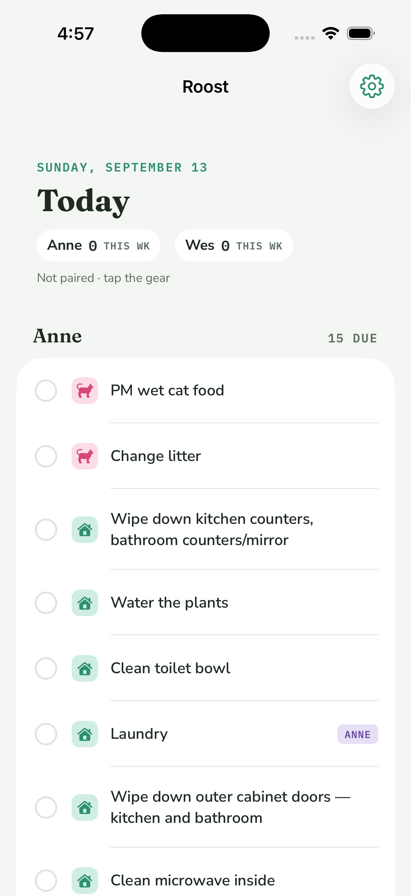

# Roost/ — the iOS app

SwiftUI + SwiftData, iOS 18+, offline-first. The phone keeps its own store and syncs it against `server/` when it can reach it. R-2 built the store and the chore list; R-8 added the Today screen, check-off, pairing, and the sync client.



## Layout

```
Roost/
  project.yml                 XcodeGen spec — the source of truth for the project
  Roost.xcodeproj             generated; regenerate, don't hand-edit
  Sources/
    RoostApp.swift            @main: registers fonts, opens (or rebuilds) the store, seeds, owns SyncCoordinator
    Models/Records.swift      SwiftData models: ChoreRecord, CompletionRecord, SyncState
    Models/Converters.swift   record <-> RoostCore value types
    Models/ChoreSeeder.swift  idempotent seed from the bundled chores.json (also used for server-sent chores)
    Models/TodayPlanner.swift pure: records -> per-person rows via RoostCore Scheduler/Tallies
    Sync/TokenStore.swift     Keychain (app) / in-memory (tests) storage for the device token
    Sync/SyncAPI.swift        typed HTTP client for server/ — no policy, no storage
    Sync/SyncClient.swift     @ModelActor: the replay + delta policy, in-flight guard
    Sync/SyncCoordinator.swift @Observable main-actor face for the views; owns NotificationScheduler
    Notifications/NotificationCenterClient.swift  the slice of UNUserNotificationCenter we use, behind a protocol
    Notifications/NotificationPlanner.swift       pure: one day's due list -> ids, copy, Chicago fire times
    Notifications/NotificationScheduler.swift     reads the store, clears + reschedules, badge, foreground observer
    Screens/TodayScreen.swift root: date, tallies, Anne/Wes sections, check-off, escalation color
    Screens/PairingScreen.swift paste a token, connect, forget
    Screens/ChoreListScreen.swift the R-2 list, reachable from the gear menu as "All chores"
  Tests/                      in-memory ModelContainer + URLProtocol stub; no network
  docs/today-r8.png           simulator screenshot (unpaired state)
```

Packages are referenced by relative path: `../Packages/RoostCore` (models, scheduler, streaks) and `../Packages/RoostDesign` (colors, fonts). The seed file is `../data/chores.json`, added to the target as a bundle resource in place, so the repo has one copy.

Bundle identifier: `xyz.hinescreative.roost`. Signing is automatic with the team left blank; set the team in Xcode locally, never commit it.

## Build

```bash
brew install xcodegen            # once
cd Roost && xcodegen generate     # after editing project.yml or adding files
open Roost.xcodeproj
```

## Test (headless)

```bash
xcodebuild -project Roost/Roost.xcodeproj -scheme Roost \
  -destination 'platform=iOS Simulator,name=iPhone 17 Pro' test
```

29 tests: seed (31 rows, 2 pinned, idempotent, retire/restore, converters), sync (pairing stores person/cursor/token; 401 stores nothing; a queued completion is POSTed once and marked synced; a 400 marks it rejected and it is never retried; offline keeps the queue; a delete replays as DELETE; a delta with `deleted: true` hides the local row; server-sent chores re-seed; overlapping syncs coalesce), and planning (pinned chores land on the right person; cat care sorts first; a completion today shows as a done row and counts in the tally; overdue days map to the escalation stage), and notifications (fixture plan yields the expected ids, Chicago fire times and titles; a replan clears the previous set; the other person's chores never appear; badge count; overlapping replans coalesce).

## Pairing

First run is unpaired: the Today screen still works locally, the status line says "Not paired · tap the gear". Gear → Pairing:

1. Wes mints a token on the server: `sudo ROOST_TOKENS=/etc/roost/tokens.json node /opt/roost/server/src/mktoken.js anne "Anne iPhone"` (see `server/README.md`).
2. Paste it in the token field. The base URL defaults to `https://roost.hinescreative.xyz`.
3. Connect calls `GET /sync?cursor=0`. On 200 the token goes into the phone's **Keychain** (`kSecClassGenericPassword`, this device only, after first unlock) and `SyncState` stores the base URL and the `person` the server reported. On 401 or a network failure nothing is stored and the error is shown.

The token is never written to UserDefaults, the SwiftData store, or logs. "Forget this device" clears the Keychain item and the pairing fields.

## Sync

`SyncClient` is a `@ModelActor` with its own context. Every pass does, in order:

1. **Replay POSTs.** Each `CompletionRecord` with `syncedAt == nil` is POSTed with its client-generated id, so a retry after a crash or a dead connection is a no-op on the server (201 new, 200 replay). Success stamps `syncedAt` and `seq`. A 400 (unknown or retired chore) sets `rejected`; the row stays visible locally and is never sent again.
2. **Replay DELETEs.** Each row with `removed && !deleteSynced` is DELETEd; 200 or 404 both mark `deleteSynced`. A row that was un-checked before it ever reached the server is marked `deleteSynced` immediately, so nothing is sent.
3. **Pull the delta.** `GET /sync?cursor=<SyncState.cursor>&choresVersion=<SyncState.choresVersion>`. Completions are upserted by id, honoring `deleted`; a local row with a pending delete keeps its local intent until step 2 has run. If the server included `chores` (version mismatch), they are re-seeded through `ChoreSeeder` exactly like the bundle. The new `cursor` and `choresVersion` are stored.

It runs on launch, when the app returns to the foreground, after every check-off, and from Gear → Sync now. An in-flight guard coalesces overlapping calls into at most one extra pass.

**Offline is not an error.** A transport failure or 5xx leaves the queue untouched, returns `.failed`, and the next trigger retries. Only a 401 aborts the pass (the token was revoked; re-pair).

## Today screen

`TodayPlanner.plan` feeds `RoostCore.Scheduler` the active chores and non-removed completions, with `activeFrom` = the household start (fixed on first render as the earlier of today and the earliest completion, then persisted in `SyncState`). For each person it lists what is due, cat care first, most overdue first, followed by rows completed today so they can be un-checked. Row color follows `EscalationStage`: due today = ink, 1–2 days = gold, 3–4 = tease, 5+ = alert, with a `ND LATE` label when overdue. The header shows the Chicago date, each person's completions this week and streak from `RoostCore.Tallies`, and the sync status line.

Checking a row inserts a `CompletionRecord` (UUID id, `completedAt` now, UTC) and kicks a sync. Tapping a done row soft-deletes it.

## Store rules

- `ChoreRecord.retired` hides chores removed from the list without losing completion history.
- `CompletionRecord.id` is client-generated; the server dedupes on it. `syncedAt` stays nil until acknowledged. `removed` is the soft-delete flag (named to avoid CoreData's reserved `isDeleted`); `deleteSynced` and `rejected` are sync bookkeeping.
- `SyncState` is a single row: `cursor` (server seq), `choresVersion`, `baseURL`, `person`, `activeFrom`, `lastSyncAt`.
- Pre-release: if the on-disk store cannot be migrated, `RoostApp` deletes it and rebuilds. Chores re-seed from the bundle and completions come back from the server on the next sync. This goes away once the schema is stable.

## Notifications

Local only (`UserNotifications`, no server involvement). `NotificationScheduler.replan()` rewrites the pending set after every successful sync and whenever the app becomes active (launch and foreground); overlapping replans coalesce. Each pass clears every pending Roost notification, then schedules, for the paired person only:

- **09:00 Chicago** one digest listing what is due that day (skipped when nothing is due).
- **18:00 Chicago** one notification per overdue chore, worded by `EscalationStage` as in the mockup: nudge "Still no <title>…", pointed "The cat has feelings about this." (cat care) or "Getting overdue." (home), alert "<Title> emergency".

Identifiers are deterministic per chore and date (`roost.overdue.<choreId>.<yyyy-MM-dd>`, `roost.digest.<yyyy-MM-dd>`), so a replan replaces rather than duplicates. The plan covers today and tomorrow (tomorrow assumes nothing else gets done and is replaced by the next replan) so a phone opened after 18:00 still gets the next ping. The app badge is the paired person's overdue count, updated with each replan. An unpaired phone gets nothing and a zero badge.

Permission (alert, sound, badge) is requested the first time pairing succeeds, not on first launch.

The other person's chores never produce a local notification here, so the mockup's "red alert visible to both of you" needs a push from the server: that is ticket R-6b (APNs), waiting on a key.
