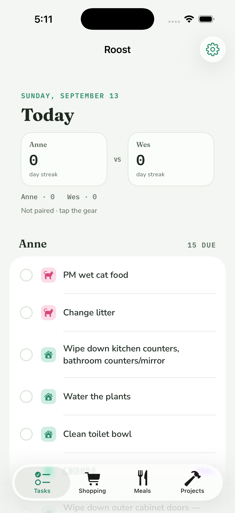
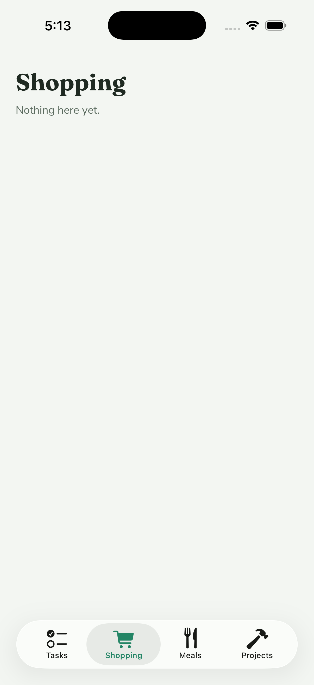

# Roost/ — the iOS app

SwiftUI + SwiftData, iOS 18+, offline-first. The phone keeps its own store and syncs it against `server/` when it can reach it. R-2 built the store and the chore list; R-8 added the Today screen, check-off, pairing, and the sync client; R-10 added the tab shell, the streak header, and the escalation copy.

| Tasks | Shopping (placeholder) |
| --- | --- |
|  |  |

Both screenshots are a fresh, unpaired simulator install: the streaks are tied at 0 so nobody is tagged as ahead, and nothing is overdue yet so no row has a subtitle.

## Layout

```
Roost/
  project.yml                 XcodeGen spec — the source of truth for the project
  Roost.xcodeproj             generated; regenerate, don't hand-edit
  Sources/
    RoostApp.swift            @main: registers fonts, opens (or rebuilds) the store, seeds, owns SyncCoordinator, shows RootTabView
    Strings.swift             every R-10 user-facing string: tab titles, placeholder line, streak labels, escalation copy
    Root/RootTabView.swift    the tab bar (RootTab: Tasks, Shopping, Meals, Projects); placeholders for all but Tasks
    Models/Records.swift      SwiftData models: ChoreRecord, CompletionRecord, SyncState
    Models/Converters.swift   record <-> RoostCore value types
    Models/ChoreSeeder.swift  idempotent seed from the bundled chores.json (also used for server-sent chores)
    Models/TodayPlanner.swift pure: records -> per-person rows via RoostCore Scheduler/Tallies
    Models/StreakHeaderModel.swift pure: streaks + weekly tallies -> two sides, the leader (nil on a tie), the tally line
    Models/EscalationCopy.swift pure: EscalationStage + category -> row subtitle (nil for dueToday and done rows)
    Sync/TokenStore.swift     Keychain (app) / in-memory (tests) storage for the device token
    Sync/SyncAPI.swift        typed HTTP client for server/ — no policy, no storage
    Sync/SyncClient.swift     @ModelActor: the replay + delta policy, in-flight guard
    Sync/SyncCoordinator.swift @Observable main-actor face for the views
    Screens/TodayScreen.swift Tasks tab: date, streak header, Anne/Wes sections, check-off, escalation color + copy, gear menu
    Screens/StreakHeaderView.swift the head-to-head block from the mockup
    Screens/PlaceholderScreen.swift title + one line, used by Shopping, Meals, and Projects until their tickets land
    Screens/PairingScreen.swift paste a token, connect, forget
    Screens/ChoreListScreen.swift the R-2 list, reachable from the gear menu as "All chores"
  Tests/                      in-memory ModelContainer + URLProtocol stub; no network
  docs/tasks-r10.png          simulator screenshot, Tasks tab (fresh unpaired install: tied streaks, nothing overdue)
  docs/shopping-r10.png       simulator screenshot, Shopping placeholder
  docs/today-r8.png           the R-8 screenshot, kept for history
```

Packages are referenced by relative path: `../Packages/RoostCore` (models, scheduler, streaks) and `../Packages/RoostDesign` (colors, fonts). The seed file is `../data/chores.json`, added to the target as a bundle resource in place, so the repo has one copy.

Bundle identifier: `xyz.hinescreative.roost`. Signing is automatic with the team left blank; set the team in Xcode locally, never commit it.

## Build

```bash
brew install xcodegen            # once
cd Roost && xcodegen generate     # after editing project.yml or adding files
open Roost.xcodeproj
```

## Test (headless)

```bash
xcodebuild -project Roost/Roost.xcodeproj -scheme Roost \
  -destination 'platform=iOS Simulator,name=iPhone 17 Pro' test
```

30 tests: seed (31 rows, 2 pinned, idempotent, retire/restore, converters), sync (pairing stores person/cursor/token; 401 stores nothing; a queued completion is POSTed once and marked synced; a 400 marks it rejected and it is never retried; offline keeps the queue; a delete replays as DELETE; a delta with `deleted: true` hides the local row; server-sent chores re-seed; overlapping syncs coalesce), planning (pinned chores land on the right person; cat care sorts first; a completion today shows as a done row and counts in the tally; overdue days map to the escalation stage), the streak header (the higher streak leads; a tie, including 0 vs 0, has no leader; sides come out Anne then Wes with missing values as 0; the tally line reads `Anne · 14   Wes · 11`; it builds from a plan), the escalation copy (no subtitle for due today; nudge names the chore; pointed depends on category; alert capitalizes the chore; every overdue stage has copy for both categories; rows flow through their stage and done rows get nothing), and the root tabs (four tabs in order with their SF Symbols; only Tasks has a real screen).

## Pairing

First run is unpaired: the Today screen still works locally, the status line says "Not paired · tap the gear". Gear → Pairing:

1. Wes mints a token on the server: `sudo ROOST_TOKENS=/etc/roost/tokens.json node /opt/roost/server/src/mktoken.js anne "Anne iPhone"` (see `server/README.md`).
2. Paste it in the token field. The base URL defaults to `https://roost.hinescreative.xyz`.
3. Connect calls `GET /sync?cursor=0`. On 200 the token goes into the phone's **Keychain** (`kSecClassGenericPassword`, this device only, after first unlock) and `SyncState` stores the base URL and the `person` the server reported. On 401 or a network failure nothing is stored and the error is shown.

The token is never written to UserDefaults, the SwiftData store, or logs. "Forget this device" clears the Keychain item and the pairing fields.

## Sync

`SyncClient` is a `@ModelActor` with its own context. Every pass does, in order:

1. **Replay POSTs.** Each `CompletionRecord` with `syncedAt == nil` is POSTed with its client-generated id, so a retry after a crash or a dead connection is a no-op on the server (201 new, 200 replay). Success stamps `syncedAt` and `seq`. A 400 (unknown or retired chore) sets `rejected`; the row stays visible locally and is never sent again.
2. **Replay DELETEs.** Each row with `removed && !deleteSynced` is DELETEd; 200 or 404 both mark `deleteSynced`. A row that was un-checked before it ever reached the server is marked `deleteSynced` immediately, so nothing is sent.
3. **Pull the delta.** `GET /sync?cursor=<SyncState.cursor>&choresVersion=<SyncState.choresVersion>`. Completions are upserted by id, honoring `deleted`; a local row with a pending delete keeps its local intent until step 2 has run. If the server included `chores` (version mismatch), they are re-seeded through `ChoreSeeder` exactly like the bundle. The new `cursor` and `choresVersion` are stored.

It runs on launch, when the app returns to the foreground, after every check-off, and from Gear → Sync now. An in-flight guard coalesces overlapping calls into at most one extra pass.

**Offline is not an error.** A transport failure or 5xx leaves the queue untouched, returns `.failed`, and the next trigger retries. Only a 401 aborts the pass (the token was revoked; re-pair).

## Screens

The root is `RootTabView`, a `TabView` over the `RootTab` enum: Tasks (`checklist`), Shopping (`cart`), Meals (`fork.knife`), Projects (`hammer`), tinted `RoostColor.accent`. Shopping, Meals, and Projects are `PlaceholderScreen`s, the tab title in the display face and one line, "Nothing here yet.", until their tickets land; the app has no sync code for those collections yet. The gear menu (All chores, Pairing…, Sync now) stays on Tasks.

Every string R-10 added, the tab titles, the placeholder line, the streak labels, and the escalation copy, lives in `Sources/Strings.swift`, so the wording can change without touching a screen.

### Tasks

`TodayPlanner.plan` feeds `RoostCore.Scheduler` the active chores and non-removed completions, with `activeFrom` = the household start (fixed on first render as the earlier of today and the earliest completion, then persisted in `SyncState`). For each person it lists what is due, cat care first, most overdue first, followed by rows completed today so they can be un-checked. The header shows the Chicago date, the streak block, the week's tallies, and the sync status line.

**Streak header.** `StreakHeaderModel` takes the plan's per-person streaks (`RoostCore.Tallies.streak`, so `activeFrom` comes from `SyncState`) and weekly tallies. Each side shows the name, the streak number, and "day streak". The side with the strictly higher streak gets a "CURRENTLY AHEAD" tag and its number in `RoostColor.gold`; a tie tags nobody. Under the block a mono line carries the week's completions: `Anne · 14   Wes · 11`.

**Escalation.** Row color follows `EscalationStage`: due today = ink, 1–2 days = gold, 3–4 = tease, 5+ = alert, with a `ND LATE` badge when overdue. `EscalationCopy.subtitle` adds a line under the title once a row is overdue: nudge → "Still no <title>…" (title lowercased to read mid-sentence, unless it starts with an acronym like "PM wet cat food"), pointed → "The cat has feelings about this." for cat-care rows and "Getting overdue." for home rows, alert → "<Title> emergency". Due-today rows and done rows show no subtitle.

Checking a row inserts a `CompletionRecord` (UUID id, `completedAt` now, UTC) and kicks a sync. Tapping a done row soft-deletes it.

## Store rules

- `ChoreRecord.retired` hides chores removed from the list without losing completion history.
- `CompletionRecord.id` is client-generated; the server dedupes on it. `syncedAt` stays nil until acknowledged. `removed` is the soft-delete flag (named to avoid CoreData's reserved `isDeleted`); `deleteSynced` and `rejected` are sync bookkeeping.
- `SyncState` is a single row: `cursor` (server seq), `choresVersion`, `baseURL`, `person`, `activeFrom`, `lastSyncAt`.
- Pre-release: if the on-disk store cannot be migrated, `RoostApp` deletes it and rebuilds. Chores re-seed from the bundle and completions come back from the server on the next sync. This goes away once the schema is stable.

Push notifications (APNs) are a later ticket.
